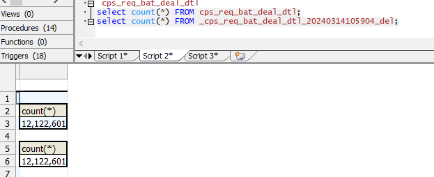

### ghost简述

gh-ost通过连接到潜在的多个服务器以及将自身强加为副本来运行，以便直接从其中一台服务器简化二进制日志事件。有多种操作模式，具体取决于你的设置、配置以及要运行迁移的位置。


#### 1. 工作三种模式：

##### a. Connect to replica, migrate on master

​	默认模式，gh-ost通过从节点找到主节点进行连接，步骤如下：

- 在主库上创建 _xxx_gho（和原表表结构一致）、_xxx_ghc（记录变更日志），并修改 _xxx_gho 表结构；
- 从 slave 上读取二进制日志事件，将变更应用到主库上的 _xxx_gho 表；
- 在主库上读源表的数据写入 _xxx_gho 表中；
- 在主库上完成表切换。

##### b. Connect to master

​	需使用 **--allow-on-master**

- 在主库上创建 _xxx_gho、_xxx_ghc，并修改 _xxx_gho 表结构；
- 从主库上读取二进制日志事件，将变更应用到主库上的 _xxx_gho 表；
- 在主库上读源表的数据写入 _xxx_gho 表中；
- 在主库上完成表切换。

##### c. Migrate/test on replica

这种模式会在从库上做修改。gh-ost 仍然会连上主库，但所有操作都是在从库上做的，不会对主库产生任何影响。在操作过程中，gh-ost 也会不时地暂停，以便从库的数据可以保持最新

- ​	**--migrate-on-replica** 选项让 gh-ost 直接在从库上修改表。最终的切换过程也是在从库正常复制的状态下完成的。
- ​	**--test-on-replica** 表明操作只是为了测试目的。在进行最终的切换操作之前，复制会被停止。原始表和临时表会相互切换，再切换回来，最终相当于原始表没被动过。主从复制暂停的状态下，你可以检查和对比这两张表中的数据。


#### 2. 工作要求：

```sql
gh-ost目前版本需要 MySQL 5.7 及更高版本。5.6需参考以往版本（1.1.6版本移除了5.7 5.6）。
需要一台服务器来提供基于行的复制 (RBR) 格式的二进制日志。现在FULL支持行图像。MINIMAL将在不久的将来得到支持。gh-ost更喜欢使用副本。你可能仍为主服务器配置了基于语句的复制(SBR)。
如果你使用副本，则主表和副本之间的表必须具有相同的架构。
```

##### 2.1 权限要求：

gh-ost需要具有以下权限的帐户：

- ALTER, CREATE, DELETE, DROP, INDEX, INSERT, LOCK TABLES, SELECT, TRIGGER, UPDATE在迁移表所在的数据库（架构）上，或者当然在*.*

- 任何一个：

  - SUPER, REPLICATION SLAVE上*.*，或：

  - REPLICATION CLIENT, REPLICATION SLAVE在*.*

    SUPER需要该权限。这些用于：STOP SLAVESTART SLAVE

- 如果不是并且*你*明确指定了，则将你切换binlog_format到ROW ROW--switch-to-rbr
  - 如果你的复制已经在 RBR ( binlog_format=ROW) 中，你可以指定--assume-rbr以避免STOP SLAVE/START SLAVE操作，因此不需要SUPER.
- gh-ost对所有 MySQL 连接使用REPEATABLE_READ事务隔离级别，无论服务器默认设置如何。
- 运行--test-on-replica：在切换阶段之前，gh-ost停止复制，以便你可以比较两个表并确认迁移是否正确。


##### 2.2 工作局限：

​	目前 外键、触发器均不支持，JSON支持MySQL 5.7列，但不作为其一部分PRIMARY KEY，不允许迁移存在同名、不同大小写的另一个表的表，表中须有主键或者唯一索引。


#### 3.1 案例测试：

###### 3.1.1 安装略过，github上下载rpm 直接安装即可（https://github.com/github/gh-ost）

b.

```sql
gh-ost \
--max-load=Threads_running=25 \												-- 当状态超过阈值时，会触发节流 例如：“Threads_running=100，Threads_connected=500”。
--critical-load=Threads_running=1000 \										-- 临界负载水平 超出会终止
--chunk-size=1000 \															-- 迁移块的大小
--throttle-control-replicas="myreplica.1.com,myreplica.2.com" \				-- 检查延迟副本列表					
--max-lag-millis=1500 \														-- 设置主从延迟的最大阈值 超过值会触发节流
--user="root" \
--password='1234' \
--host='10.10.102.101' \
--port=3306 \
--database="icps2" \
--allow-on-master \															-- 允许在主库上运行操作，最好是在从库运行
--table="cps_transactions_copy2" \
--verbose \											-- 可忽略
--alter="drop index index_transsource" \									-- 变更语句
--switch-to-rbr \															-- 在迁移期间切换到基于行的复制模式
--allow-master-master \														-- 允许在主主复制环境中运行迁移操作
--cut-over=default \								-- 可忽略	              -- 指定迁移的切换方式，默认为 default。
--exact-rowcount \															-- 在切换期间确保行数的准确性。
--concurrent-rowcount \														-- 在切换期间并发计算行数。
--heartbeat-interval-millis=2000 \											-- 设置心跳间隔，以毫秒为单位。
--default-retries=120 \														-- 操作失败时的默认重试次数。
--panic-flag-file=/tmp/ghost.panic.flag \									-- 在发生紧急情况时触发的标志文件路径
--timestamp-old-table \														-- 在迁移期间给旧表添加时间戳列。
--postpone-cut-over-flag-file=/tmp/ghost.postpone.flag						-- 当文件存在时，迁移将推迟交换表的最后阶段，并将继续同步ghost表，一旦文件被删除，切换就可以开始执行了
--initially-drop-ghost-table						-- 可忽略                -- 删除_ghc\_gho 相关表
[--execute]																	-- 使用 --execute ，迁移实际上会复制数据并翻转表。没有它，这是一场 noop 奔跑。
```

执行gh-ost与--postpone-cut-over-flag-file=/path/to/flag.file.只要这个文件存在，gh-ost就不会采取最后的切换步骤。它将完成行复制，并通过不断地将对原始表所做的更改应用到幽灵表来继续同步表。它可以不断地这样做。当你最终准备好时，删除文件并进行切换。

##### 3.2 测试命令如下：

```sql
gh-ost \
--max-load=Threads_running=25 \
--critical-load=Threads_running=1000 \
--chunk-size=1000 \
--max-lag-millis=1500 \
--user="root" \
--password='1234' \
--host='10.10.102.101' \
--port=3306 \
--database="icps2" \
--allow-on-master \
--table="cps_req_bat_deal_dtl" \
--alter="drop index index_bussiness_dep" \
--switch-to-rbr \
--allow-master-master \
--exact-rowcount \
--concurrent-rowcount \
--heartbeat-interval-millis=2000 \
--default-retries=120 \
--panic-flag-file=/tmp/ghost.panic.flag \
--timestamp-old-table \
--postpone-cut-over-flag-file=/tmp/ghost.postpone.flag \
--execute
```

##### 3.3 执行过程中会有如下的日志打印，代表的含义如下：

- Copy：从原表 copy row 的进度，三列分别代表已 cpoy 的行、预估行数、进度
- Applied：表示从二进制日志中读取并应用到幽灵表上的行数
- Backlog：当前处理二进制日志的积压数量
- Time：执行时间
- streamer：当前处理到的二进制日志的位置
- Lag：延时时间
- State：状态（migrating：正常迁移，throttled：限流中，postponing cut-over：等待转换）
- ETA：预估的完成耗时

```sql
Copy: 2072000/12122601 17.1%; Applied: 0; Backlog: 0/1000; Time: 2m55s(total), 2m55s(copy); streamer: mysql-bin.000002:71855953; Lag: 0.02s, HeartbeatLag: 0.02s, State: migrating; ETA: 14m8s
Copy: 2134000/12122601 17.6%; Applied: 0; Backlog: 0/1000; Time: 3m0s(total), 3m0s(copy); streamer: mysql-bin.000002:81487996; Lag: 0.02s, HeartbeatLag: 0.02s, State: migrating; ETA: 14m2s
```

当状态成为 postponing cut-over 后，我们就可以进行下一步的转换环节，转换方式有两种，第一种是删除创建的标志文件，标志文件为 **--postpone-cut-over-flag-file** 选项定义的。第二种是执行交互式命令，这里我们采用第二种。

通过输出的日志，可以看到状态已经处于 postponing cut-over。

```sql
Copy: 12122601/12122601 100.0%; Applied: 0; Backlog: 0/1000; Time: 15m17s(total), 15m17s(copy); streamer: mysql-bin.000005:14930038; Lag: 0.02s, HeartbeatLag: 0.11s, State: migrating; ETA: due
Copy: 12122601/12122601 100.0%; Applied: 0; Backlog: 0/1000; Time: 15m18s(total), 15m17s(copy); streamer: mysql-bin.000005:15010356; Lag: 0.02s, HeartbeatLag: 0.02s, State: postponing cut-over; ETA: due
Copy: 12122601/12122601 100.0%; Applied: 0; Backlog: 0/1000; Time: 15m19s(total), 15m17s(copy); streamer: mysql-bin.000005:15011135; Lag: 0.02s, HeartbeatLag: 0.02s, State: postponing cut-over; ETA: due
```

##### 3.4 执行以下命令进行转换：

```sql
[root@informatica tmp]# echo "unpostpone" |nc -U gh-ost.nglicps2.cps_req_bat_deal_dtl.sock
Unpostponed
# Migrating nglicps2.cps_req_bat_deal_dtl; Ghost table is nglicps2._cps_req_bat_deal_dtl_gho
# Migrating dingjia-mysql:3306; inspecting dingjia-mysql:3306; executing on informatica
# Migration started at Thu Mar 14 10:59:04 +0800 2024
# chunk-size: 1000; max-lag-millis: 1500ms; dml-batch-size: 10; max-load: Threads_running=25; critical-load: Threads_running=1000; nice-ratio: 0.000000
# throttle-additional-flag-file: /tmp/gh-ost.throttle
# postpone-cut-over-flag-file: /tmp/ghost.postpone.flag [set]
# panic-flag-file: /tmp/ghost.panic.flag
# Serving on unix socket: /tmp/gh-ost.nglicps2.cps_req_bat_deal_dtl.sock
Copy: 12122601/12122601 100.0%; Applied: 0; Backlog: 0/1000; Time: 16m5s(total), 15m17s(copy); streamer: mysql-bin.000005:15047372; Lag: 0.02s, HeartbeatLag: 0.19s, State: postponing cut-over; ETA: due
```

##### 3.5 查看日志输出，可以看到转换完成：

```sql
Copy: 12122601/12122601 100.0%; Applied: 0; Backlog: 0/1000; Time: 16m5s(total), 15m17s(copy); streamer: mysql-bin.000005:15047008; Lag: 0.02s, HeartbeatLag: 0.02s, State: postponing cut-over; ETA: due
# Migrating nglicps2.cps_req_bat_deal_dtl; Ghost table is nglicps2._cps_req_bat_deal_dtl_gho
# Migrating dingjia-mysql:3306; inspecting dingjia-mysql:3306; executing on informatica
# Migration started at Thu Mar 14 10:59:04 +0800 2024
# chunk-size: 1000; max-lag-millis: 1500ms; dml-batch-size: 10; max-load: Threads_running=25; critical-load: Threads_running=1000; nice-ratio: 0.000000
# throttle-additional-flag-file: /tmp/gh-ost.throttle
# postpone-cut-over-flag-file: /tmp/ghost.postpone.flag [set]
# panic-flag-file: /tmp/ghost.panic.flag
# Serving on unix socket: /tmp/gh-ost.nglicps2.cps_req_bat_deal_dtl.sock
Copy: 12122601/12122601 100.0%; Applied: 0; Backlog: 0/1000; Time: 16m5s(total), 15m17s(copy); streamer: mysql-bin.000005:15047372; Lag: 0.02s, HeartbeatLag: 0.19s, State: postponing cut-over; ETA: due
Copy: 12122601/12122601 100.0%; Applied: 0; Backlog: 0/1000; Time: 16m6s(total), 15m17s(copy); streamer: mysql-bin.000005:15048152; Lag: 0.02s, HeartbeatLag: 0.02s, State: postponing cut-over; ETA: due
Copy: 12122601/12122601 100.0%; Applied: 0; Backlog: 1/1000; Time: 16m7s(total), 15m17s(copy); streamer: mysql-bin.000005:15049676; Lag: 0.02s, HeartbeatLag: 0.02s, State: migrating; ETA: due
# Migrating nglicps2.cps_req_bat_deal_dtl; Ghost table is nglicps2._cps_req_bat_deal_dtl_gho
# Migrating dingjia-mysql:3306; inspecting dingjia-mysql:3306; executing on informatica
# Migration started at Thu Mar 14 10:59:04 +0800 2024
# chunk-size: 1000; max-lag-millis: 1500ms; dml-batch-size: 10; max-load: Threads_running=25; critical-load: Threads_running=1000; nice-ratio: 0.000000
# throttle-additional-flag-file: /tmp/gh-ost.throttle
# postpone-cut-over-flag-file: /tmp/ghost.postpone.flag [set]
# panic-flag-file: /tmp/ghost.panic.flag
# Serving on unix socket: /tmp/gh-ost.nglicps2.cps_req_bat_deal_dtl.sock
Copy: 12122601/12122601 100.0%; Applied: 0; Backlog: 0/1000; Time: 16m7s(total), 15m17s(copy); streamer: mysql-bin.000005:15050030; Lag: 0.02s, HeartbeatLag: 0.14s, State: migrating; ETA: due
[2024/03/14 11:15:12] [info] binlogsyncer.go:180 syncer is closing...
[2024/03/14 11:15:12] [info] binlogsyncer.go:864 kill last connection id 133
[2024/03/14 11:15:12] [info] binlogsyncer.go:210 syncer is closed
# Done
```

校验是否生效。

##### 4. 最后收尾：

###### 4.1 校验表数据是否正常



###### 4.2 删除旧表

​	DROP TABLE _cps_req_bat_deal_dtl_20240314105904_del;

​	[root@informatica tmp]# rm ghost.postpone.flag
​	rm：是否删除普通空文件 "ghost.postpone.flag"？y


#### 5. Interactive interfaces 交互式界面：

###### 5.1 安装nc命令 yum install 

- 需要安装 **nmap-ncat** 包来使用 nc 命令
- 使用方式为 **echo "命令" | nc -U socket文件名**，例如：**echo status | nc -U gh-ost.nglicps2.cps_transactions_copy2.sock**

gh-ost 监听：

- Unix套接字文件：无论是通过提供--serve-socket-file还是由 确定gh-ost，该接口始终处于开启状态。如果自行确定，gh-ost将在启动时和整个迁移过程中通告套接字文件的标识。
- TCP：如果--serve-tcp-port提供

两个接口可以同时服务。两者都响应简单的文本命令，这使得通过 shell 进行交互变得容易。


##### 5.2 动态重新配置

chunk-size=5000但你发现它太多了。你想减少它。无需终止并使用新配置重新启动迁移。你可以动态更改chunk-size

```
echo "chunk-size=250" | nc -U /tmp/gh-ost.test.sample_data_0.sock
```

同样，可以更改max-load配置：

```
echo "max-load=Threads_running=50,threads_connected=1000" | nc -U /tmp/gh-ost.test.sample_data_0.sock
```


#### 6. Known Commands

- help：显示可用命令的简短列表
- status：返回迁移进度和配置的详细状态摘要
- sup：返回迁移进度的简要状态摘要
- cpu-profile[runtime/pprof](https://pkg.go.dev/runtime/pprof)：使用持续时间返回 Base64 编码的CPU 配置文件，默认值： 30s。以逗号分隔的选项gzip和/或block（阻止的配置文件）可能位于配置文件持续时间之后
- coordinates：返回受检查服务器的最近（尽管不完全是最新）二进制日志坐标
- applier：返回应用程序的主机名
- inspector：返回检查器的主机名
- chunk-size=<newsize>：修改chunk-size；适用于下一次运行的复制迭代
- dml-batch-size=<newsize>：修改dml-batch-size；适用于下次应用二进制日志事件
- max-lag-millis=<max-lag>：修改最大复制滞后阈值（毫秒，最小值为100，即0.1秒）
- max-load=<max-load-thresholds> ：修改max-load 配置；适用于下一次运行的复制迭代:  1. 格式max-load必须是：some_status=<numeric-threshold>[,some_status=<numeric-threshold>...]' 2. 例如：Threads_running=50,threads_connected=1000，然后你将写入/回显max-load=Threads_running=50,threads_connected=1000到套接字。
- critical-load=<critical-load-thresholds>：修改critical-load 配置（超过这些阈值将中止操作）:   格式critical-load必须是：some_status=<numeric-threshold>[,some_status=<numeric-threshold>...]'   例如：Threads_running=1000,threads_connected=5000，然后你将写入/回显critical-load=Threads_running=1000,threads_connected=5000到套接字。

> nice-ratio=<ratio> ：改变nice比率：0代表激进（不nice，不睡觉），正整数n：
> 	-- 对于任何 1ms 花在复制行上的时间，花 n*1ms 单位时间睡觉。
> 	-- 100ms 示例：假设完成 单行块复制。
> 		-- nice-ratio=0.5 将导致立即gh-ost睡眠。50ms
> 		-- nice-ratio=1 将导致gh-ost睡眠100ms，有效地使运行时间加倍的值 ,2 将有效地使运行时间增加三倍； ETC。

- throttle-http：更改节流 HTTP 端点
- throttle-query：更改油门查询
- throttle-control-replicas='replica1,replica2'：更改节流控制副本列表，这些副本gh-ost将检查。这需要一个逗号分隔的副本列表来检查并替换以前的列表。
- throttle：强制迁移暂停
- no-throttle：取消强制暂停（尽管其他节流原因可能仍然适用）
- unpostponegh-ost：在推迟[切换](https://github.com/github/gh-ost/blob/master/doc/cut-over.md)阶段时，指示gh-ost停止推迟并立即进行切换。
- panic：立即恐慌并中止操作


##### 6.1 例子迁移运行时：

```
$ echo status | nc -U /tmp/gh-ost.test.sample_data_0.sock
# Migrating test.sample_data_0; Ghost table is test._sample_data_0_gst
# Migration started at Tue Jun 07 11:45:16 +0200 2016
# chunk-size: 200; max lag: 1500ms; dml-batch-size: 10; max-load: map[Threads_connected:20]
# Throttle additional flag file: /tmp/gh-ost.throttle
# Serving on unix socket: /tmp/gh-ost.test.sample_data_0.sock
# Serving on TCP port: 10001
Copy: 0/2915 0.0%; Applied: 0; Backlog: 0/100; Elapsed: 40s(copy), 41s(total); streamer: mysql-bin.000550:49942; ETA: throttled, flag-file
```

```
$ echo "chunk-size=250" | nc -U /tmp/gh-ost.test.sample_data_0.sock
# Migrating test.sample_data_0; Ghost table is test._sample_data_0_gst
# Migration started at Tue Jun 07 11:56:03 +0200 2016
# chunk-size: 250; max lag: 1500ms; dml-batch-size: 10; max-load: map[Threads_connected:20]
# Throttle additional flag file: /tmp/gh-ost.throttle
# Serving on unix socket: /tmp/gh-ost.test.sample_data_0.sock
# Serving on TCP port: 10001
```

```
$ echo "chunk-size=?" | nc -U /tmp/gh-ost.test.sample_data_0.sock
250
```

```
$ echo throttle | nc -U /tmp/gh-ost.test.sample_data_0.sock

$ echo status | nc -U /tmp/gh-ost.test.sample_data_0.sock
# Migrating test.sample_data_0; Ghost table is test._sample_data_0_gst
# Migration started at Tue Jun 07 11:56:03 +0200 2016
# chunk-size: 250; max lag: 1500ms; max-load: map[Threads_connected:20]
# Throttle additional flag file: /tmp/gh-ost.throttle
# Serving on unix socket: /tmp/gh-ost.test.sample_data_0.sock
# Serving on TCP port: 10001
Copy: 0/2915 0.0%; Applied: 0; Backlog: 0/100; Elapsed: 59s(copy), 59s(total); streamer: mysql-bin.000551:68067; ETA: throttled, commanded by user
```


##### 6.2 查看详细的执行状态信息：

```text
[root@10-186-61-96 tmp]# echo status | nc -U sbtest1.gh-ost.socket
# Migrating sbtest.sbtest1; Ghost table is sbtest._sbtest1_gho
# Migrating 10-186-61-20:3306; inspecting 10-186-61-20:3306; executing on 10-186-61-96
# Migration started at Mon Feb 17 02:08:10 +0000 2020
# chunk-size: 100000; max-lag-millis: 1500ms; dml-batch-size: 100; max-load: Threads_running=100; critical-load: Threads_running=1000; nice-ratio: 0.000000
# throttle-flag-file: /tmp/sbtest1.throttle 
# throttle-additional-flag-file: /tmp/gh-ost.throttle 
# throttle-control-replicas count: 1
# postpone-cut-over-flag-file: /tmp/sbtest1.postpone 
# panic-flag-file: /tmp/sbtest1.panic
# Serving on unix socket: /tmp/sbtest1.gh-ost.socket
Copy: 19733607/19731368 100.0%; Applied: 3425325; Backlog: 863/1000; Time: 5h18m48s(total), 5h18m48s(copy); streamer: mysql_bin.000083:192819590; Lag: 0.01s, State: throttled, 10.186.61.96:3306 replica-lag=3.686724s; ETA: due
```

##### 6.3 打印简短的状态信息：

```text
[root@10-186-61-96 tmp]# echo sup | nc -U sbtest1.gh-ost.socket
Copy: 19833607/19731368 100.5%; Applied: 3479988; Backlog: 1000/1000; Time: 5h22m21s(total), 5h22m21s(copy); streamer: mysql_bin.000084:12427624; Lag: 1.61s, State: migrating; ETA: due
```

##### 6.4 打印当前检查的 binlog 的位置信息：

```text
[root@10-186-61-96 tmp]# echo coordinates |nc -U sbtest1.gh-ost.socket 
mysql_bin.000131:10563681
```

##### 6.5 可动态修改的参数：

具体参数含义参考常用参数介绍。

```sql
chunk-size=<newsize>              	   # Set a new chunk-size
dml-batch-size=<newsize>             	 # Set a new dml-batch-size
nice-ratio=<ratio>                   		 # Set a new nice-ratio, immediate sleep after each row-copy operation, float (examples: 0 is aggressive, 0.7 adds 70% runtime, 1.0 doubles runtime, 2.0 triples runtime, ...)
critical-load=<load>                 		 # Set a new set of max-load thresholds
max-lag-millis=<max-lag>            		   # Set a new replication lag threshold
replication-lag-query=<query>     		  	# Set a new query that determines replication lag (no quotes)
max-load=<load>                    				  # Set a new set of max-load thresholds
throttle-query=<query>         				  # Set a new throttle-query (no quotes)
throttle-http=<URL>                  		# Set a new throttle URL
throttle-control-replicas=<replicas> 	 # Set a new comma delimited list of throttle control replicas
```

> [root@10-186-61-96 tmp]# echo "chunk-size=10000" |nc -U sbtest1.gh-ost.socket

##### 6.6 强制节流和取消节流

> throttle                             # Force throttling
> no-throttle                       # End forced throttling (other throttling may still apply)

gh-ost 默认在完成所有的 copy 动作后，不会马上转换原表和幽灵表，而是继续读取binlog应用到幽灵表中，直到发出转换的动作，所以发出此命令会立刻开始转换。

> unpostpone                           # Bail out a cut-over postpone; proceed to cut-over

##### 6.7 关于退出

不清理现场，发出此命令后会立刻停止所有动作并退出进程：

> panic                                # panic and quit without cleanup

##### 6.8 补充:

打印出所有可用命令与解释：

```text
[root@10-186-61-103 tmp]# echo help  | nc -U sbtest1.gh-ost.socket 
available commands:
status                               # Print a detailed status message
sup                                  # Print a short status message
coordinates                             # Print the currently inspected coordinates
chunk-size=<newsize>                 # Set a new chunk-size
dml-batch-size=<newsize>             # Set a new dml-batch-size
nice-ratio=<ratio>                   # Set a new nice-ratio, immediate sleep after each row-copy operation, float (examples: 0 is aggressive, 0.7 adds 70% runtime, 1.0 doubles runtime, 2.0 triples runtime, ...)
critical-load=<load>                 # Set a new set of max-load thresholds
max-lag-millis=<max-lag>             # Set a new replication lag threshold
replication-lag-query=<query>        # Set a new query that determines replication lag (no quotes)
max-load=<load>                      # Set a new set of max-load thresholds
throttle-query=<query>               # Set a new throttle-query (no quotes)
throttle-http=<URL>                  # Set a new throttle URL
throttle-control-replicas=<replicas> # Set a new comma delimited list of throttle control replicas
throttle                             # Force throttling
no-throttle                          # End forced throttling (other throttling may still apply)
unpostpone                           # Bail out a cut-over postpone; proceed to cut-over
panic                                # panic and quit without cleanup
help                                 # This message
- use '?' (question mark) as argument to get info rather than set. e.g. "max-load=?" will just print out current max-load
```

> ​	这种模式会在从库上做修改。gh-ost 仍然会连上主库，但所有操作都是在从库上做的，不会对主库产生任何影响。在操作过程中，gh-ost 也会不时地暂停，以便从库的数据可以保持最新

