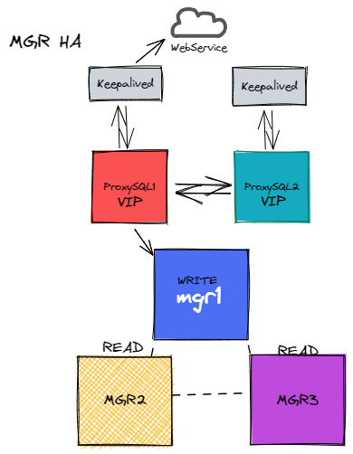
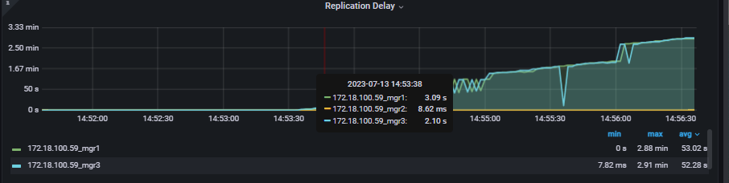

#### MGR

##### 		架构图:



######  相关版本：

```sql
-- 高可用 简易部署 读写分离 自动容灾 7*24
MySQL 8.0.28
ProxySQL 2.5.2
Keepalived 2
```

 MySQL安装略过 ..

#####  主要参数：

 ```sql
 plugin_load_add='group_replication.so'
 skip_replica_start=ON
 loose-group_replication_group_name="aaaaaaaa-aaaa-aaaa-aaaa-aaaaaaaaaabc"
 loose-group_replication_start_on_boot=off
 loose-group_replication_member_weigth = 40 #权重
 loose-group_replication_local_address="172.18.100.59:60001"
 loose-group_replication_group_seeds="172.18.100.59:60001,172.18.100.59:60002,172.18.100.59:60003"
 group_replication_bootstrap_group=off #引导作用
 binlog_checksum=none
 
 -- 该参数作用注册ip node, 部署过程中 error log会有显著提示，测试多实例mgr没有这个问题
 group_replication_ip_allowlist="172.18.100.59,172.18.100.60.."
 
 -- node2 node3 修改对应参数loose-group_replication_local_address、server_id
 ```

```sql
-- node1 节点 引导 注册 开组复制
mysql> SET SQL_LOG_BIN=0;
ERROR 2013 (HY000): Lost connection to MySQL server during query
No connection. Trying to reconnect...
Enter password:
Connection id:    8
Current database: *** NONE ***
Query OK, 0 rows affected (5.96 sec)
mysql> CREATE USER rpl_user@'%' IDENTIFIED WITH mysql_native_password BY '2&Ru@bbMT';
Query OK, 0 rows affected (0.05 sec)
mysql> GRANT REPLICATION SLAVE ON *.* TO rpl_user@'%';
Query OK, 0 rows affected (0.00 sec)
mysql> GRANT BACKUP_ADMIN ON *.* TO rpl_user@'%';
Query OK, 0 rows affected (0.00 sec)
mysql> FLUSH PRIVILEGES;
Query OK, 0 rows affected (0.01 sec)
mysql> SET GLOBAL group_replication_bootstrap_group=ON;
Query OK, 0 rows affected (0.00 sec)
mysql> START GROUP_REPLICATION USER='rpl_user', PASSWORD='2&Ru@bbMT';
Query OK, 0 rows affected (1.25 sec)
mysql> SET GLOBAL group_replication_bootstrap_group=OFF;
Query OK, 0 rows affected (0.00 sec)
mysql> SELECT * FROM performance_schema.replication_group_members;
+---------------------------+--------------------------------------+---------------+-------------+--------------+-------------+----------------+----------------------------+
| CHANNEL_NAME              | MEMBER_ID                            | MEMBER_HOST   | MEMBER_PORT | MEMBER_STATE | MEMBER_ROLE | MEMBER_VERSION | MEMBER_COMMUNICATION_STACK |
+---------------------------+--------------------------------------+---------------+-------------+--------------+-------------+----------------+----------------------------+
| group_replication_applier | ecdd0685-2077-11ee-b4ec-0050568a1004 | dingjia-mysql |        4406 | ONLINE       | PRIMARY     | 8.0.28         | XCom                       |
+---------------------------+--------------------------------------+---------------+-------------+--------------+-------------+----------------+----------------------------+
1 row in set (0.00 sec)
```

```sql
-- node2 节点 启动组复制 即可，如
SET SQL_LOG_BIN=0;
CREATE USER rpl_user@'%' IDENTIFIED WITH mysql_native_password BY '2&Ru@bbMT';
GRANT REPLICATION SLAVE ON *.* TO rpl_user@'%';
GRANT BACKUP_ADMIN ON *.* TO rpl_user@'%';
FLUSH PRIVILEGES;
SET SQL_LOG_BIN=1;
CHANGE REPLICATION SOURCE TO SOURCE_USER='rpl_user', SOURCE_PASSWORD='2&Ru@bbMT' FOR CHANNEL 'group_replication_recovery';
START GROUP_REPLICATION USER='rpl_user', PASSWORD='2&Ru@bbMT';
SELECT * FROM performance_schema.replication_group_members;

-- ERROR slave SQL thread aborted(MY-010584),主库 SHOW VARIABLES LIKE '%GTID%',获取gtid_executed slave：reset master; SET GLOBAL GTID_PURGED='SELECT @@gtid_executed'; START GROUP_REPLICATION;即可

-- 组复制
mysql> SELECT * FROM performance_schema.replication_group_members;
+---------------------------+--------------------------------------+---------------+-------------+--------------+-------------+----------------+----------------------------+
| CHANNEL_NAME              | MEMBER_ID                            | MEMBER_HOST   | MEMBER_PORT | MEMBER_STATE | MEMBER_ROLE | MEMBER_VERSION | MEMBER_COMMUNICATION_STACK |
+---------------------------+--------------------------------------+---------------+-------------+--------------+-------------+----------------+----------------------------+
| group_replication_applier | 37720249-207c-11ee-b7ee-0050568a1004 | dingjia-mysql |        4407 | ONLINE       | SECONDARY   | 8.0.28         | XCom                       |
| group_replication_applier | 38954200-207f-11ee-9bc6-0050568a1004 | dingjia-mysql |        4408 | ONLINE       | SECONDARY   | 8.0.28         | XCom                       |
| group_replication_applier | ecdd0685-2077-11ee-b4ec-0050568a1004 | dingjia-mysql |        4406 | ONLINE       | PRIMARY     | 8.0.28         | XCom                       |
+---------------------------+--------------------------------------+---------------+-------------+--------------+-------------+----------------+----------------------------+
3 rows in set (0.00 sec)
```

##### 读写分离：

######  ProxySQL

 ```sql
 -- 在主节点创建个视图：sys.gr_member_routing_candidate_status mgr状态信息视图 获取read状态
 	-- MySQL 8.0.28
 	https://github.com/sysown/proxysql/issues/3406
 	-- 在MGR主节点创建监控用户用于ProxySQL监控数据库状态：
 	create user 'monitor'@'%' identified by '2&Ru@bbMT';
 	grant select on sys.* to 'monitor'@'%';
 	grant SUPER, REPLICATION CLIENT on *.* to 'monitor'@'%';
 	-- 在MGR主节点创建用户，用于ProxySQL访问：
 	create user 'proxysql'@'%' identified by '2&Ru@bbMT';
 	grant all PRIVILEGES on *.* to 'proxysql'@'%';
 	ALTER USER 'proxysql'@'%' IDENTIFIED WITH mysql_native_password BY '2&Ru@bbMT'; # ProxySQL 2 版本是不支持MySQL8 chaing插件、要还原到mysql_native_password;否则会报错
 	flush privileges;
 	 -- mysql_servers添加后端节点：
 		insert into mysql_servers(hostgroup_id,hostname,port,weight,max_connections,max_replication_lag,comment) values (10,'172.18.100.59',4406,1,3000,10,'mgr_node1');
 		insert into mysql_servers(hostgroup_id,hostname,port,weight,max_connections,max_replication_lag,comment) values (10,'172.18.100.59',4407,1,3000,10,'mgr_node2');
 		insert into mysql_servers(hostgroup_id,hostname,port,weight,max_connections,max_replication_lag,comment) values (10,'172.18.100.59',4408,1,3000,10,'mgr_node3');
 		load mysql users to runtime; #加载到runtime
 		load mysql servers to runtime;
 		load mysql query rules to runtime;
 		load mysql variables to runtime;
 		load admin variables to runtime;
 		save mysql users to disk; #保存到磁盘
 		save mysql servers to disk;
 		save mysql query rules to disk;
 		save mysql variables to disk;
 		save admin variables to disk;
 		-- 加载生效;
 		 -- 设置监控用户账户密码：
 		 set mysql-monitor_username='monitor';
 		 set mysql-monitor_password='2&Ru@bbMT';
 		 -- 加载生效 ..
 	-- 设置提供访问的用户:
 	 insert into mysql_users(username,password,active,default_hostgroup,transaction_persistent)values('proxysql','2&Ru@bbMT',1,10,1); #password最好在MYSQL端进行加密、insert加密后的密码;
 	
 	-- 配置mysql_group_replication_hostgroups表：
 	insert into mysql_group_replication_hostgroups(writer_hostgroup,backup_writer_hostgroup,reader_hostgroup,offline_hostgroup,active,max_writers,writer_is_also_reader,max_transactions_behind)  values(10,20,30,40,1,1,0,0);
 	 -- 加载生效 ..
 	-- 设置读写分离规则：
 	insert into mysql_query_rules(rule_id,active,match_digest,destination_hostgroup,apply)values(1,1,'^SELECT.*FOR UPDATE$',10,1);
 	insert into mysql_query_rules(rule_id,active,match_digest,destination_hostgroup,apply)values(2,1,'^SELECT',30,1);
 	 -- 加载生效 ..
 	 
  -- 查看后端节点健康状态：
  mysql> SELECT * FROM monitor.mysql_server_connect_log ORDER BY time_start_us DESC LIMIT 10 ; #连接相关
 +---------------+------+------------------+-------------------------+---------------+
 | hostname      | port | time_start_us    | connect_success_time_us | connect_error |
 +---------------+------+------------------+-------------------------+---------------+
 | 172.18.100.59 | 4407 | 1689151652696888 | 1744                    | NULL          |
 | 172.18.100.59 | 4408 | 1689151652180348 | 1499                    | NULL          |
 | 172.18.100.59 | 4406 | 1689151651663945 | 1708                    | NULL          |
 | 172.18.100.59 | 4408 | 1689151592730732 | 1755                    | NULL          |
 | 172.18.100.59 | 4407 | 1689151592196949 | 1692                    | NULL          |
 | 172.18.100.59 | 4406 | 1689151591663216 | 1818                    | NULL          |
 | 172.18.100.59 | 4406 | 1689151532900533 | 1943                    | NULL          |
 | 172.18.100.59 | 4407 | 1689151532281604 | 1701                    | NULL          |
 | 172.18.100.59 | 4408 | 1689151531662635 | 1753                    | NULL          |
 | 172.18.100.59 | 4408 | 1689151472982004 | 1664                    | NULL          |
 +---------------+------+------------------+-------------------------+---------------+
 10 rows in set (0.00 sec)
 
 mysql> SELECT * FROM monitor.mysql_server_ping_log ORDER BY time_start_us DESC LIMIT 10;
 +---------------+------+------------------+----------------------+------------+
 | hostname      | port | time_start_us    | ping_success_time_us | ping_error |
 +---------------+------+------------------+----------------------+------------+
 | 172.18.100.59 | 4407 | 1689151721473719 | 355                  | NULL       |
 | 172.18.100.59 | 4406 | 1689151721473698 | 398                  | NULL       |
 | 172.18.100.59 | 4408 | 1689151721473519 | 514                  | NULL       |
 | 172.18.100.59 | 4407 | 1689151711472959 | 365                  | NULL       |
 | 172.18.100.59 | 4408 | 1689151711472950 | 334                  | NULL       |
 | 172.18.100.59 | 4406 | 1689151711472740 | 486                  | NULL       |
 | 172.18.100.59 | 4408 | 1689151701472446 | 302                  | NULL       |
 | 172.18.100.59 | 4407 | 1689151701472405 | 367                  | NULL       |
 | 172.18.100.59 | 4406 | 1689151701472304 | 403                  | NULL       |
 | 172.18.100.59 | 4406 | 1689151691471949 | 297                  | NULL       |
 +---------------+------+------------------+----------------------+------------+
 10 rows in set (0.00 sec)
   
   -- MGR配置
  mysql> select * from mysql_group_replication_hostgroups\G;
 *************************** 1. row ***************************
        writer_hostgroup: 10 #写组
 backup_writer_hostgroup: 20 #后备写组
        reader_hostgroup: 30 #读组
       offline_hostgroup: 40 #下线组
                  active: 1  #是否启用
             max_writers: 1  #最多的写节点个数
   writer_is_also_reader: 0  #决定一个节点升级为写节点(放进writer_hostgroup)后是否仍然保留在reader_hostgroup组中提供读服务。如果mgr多主模式需要设置为1
 max_transactions_behind: 0  #该字段决定最多延后写节点多少个事务
                 comment: NULL # 注释
 1 row in set (0.00 sec)
 
  -- MGR相关的监控指标
  mysql> select * from mysql_server_group_replication_log desc limit 10;
 +---------------+------+------------------+-----------------+------------------+-----------+---------------------+-------+
 | hostname      | port | time_start_us    | success_time_us | viable_candidate | read_only | transactions_behind | error |
 +---------------+------+------------------+-----------------+------------------+-----------+---------------------+-------+
 | 172.18.100.59 | 4406 | 1689151626312091 | 2109            | YES              | NO        | 0                   | NULL  |
 | 172.18.100.59 | 4406 | 1689151631312369 | 1807            | YES              | NO        | 0                   | NULL  |
 | 172.18.100.59 | 4406 | 1689151636313207 | 1568            | YES              | NO        | 0                   | NULL  |
 | 172.18.100.59 | 4406 | 1689151641312579 | 2501            | YES              | NO        | 0                   | NULL  |
 | 172.18.100.59 | 4406 | 1689151646312607 | 1385            | YES              | NO        | 0                   | NULL  |
 | 172.18.100.59 | 4406 | 1689151651313157 | 1536            | YES              | NO        | 0                   | NULL  |
 | 172.18.100.59 | 4406 | 1689151656312860 | 1769            | YES              | NO        | 0                   | NULL  |
 | 172.18.100.59 | 4406 | 1689151661312742 | 1502            | YES              | NO        | 0                   | NULL  |
 | 172.18.100.59 | 4406 | 1689151666313273 | 1501            | YES              | NO        | 0                   | NULL  |
 | 172.18.100.59 | 4406 | 1689151671313478 | 1565            | YES              | NO        | 0                   | NULL  |
 +---------------+------+------------------+-----------------+------------------+-----------+---------------------+-------+
 10 rows in set (0.00 sec)
 
  -- MGR相关状态
  mysql> select hostgroup_id,hostname,port,status,max_replication_lag from runtime_mysql_servers;
 +--------------+---------------+------+--------+---------------------+
 | hostgroup_id | hostname      | port | status | max_replication_lag |
 +--------------+---------------+------+--------+---------------------+
 | 10           | 172.18.100.59 | 4406 | ONLINE | 10                  |
 | 30           | 172.18.100.59 | 4407 | ONLINE | 10                  |
 | 30           | 172.18.100.59 | 4408 | ONLINE | 10                  |
 +--------------+---------------+------+--------+---------------------+
 3 rows in set (0.00 sec)
 
  -- 读写分离测试 读走的30组也就是只读组 07、08 只读组
  [root@172-18-100-162 ~]# for i in `seq 1 10`; do mysql -uproxysql -p -h172.18.100.162 -P6033 -e 'select * from performance_schema.global_variables where variable_name="server_id";' ; done  | grep server
 Enter password:
 server_id       594408
 Enter password:
 server_id       594407
 Enter password:
 server_id       594407
 Enter password:
 server_id       594408
 Enter password:
 server_id       594407
 Enter password:
 server_id       594408
 Enter password:
 server_id       594407
 Enter password:
 server_id       594408
 Enter password:
 server_id       594408
 Enter password:
 server_id       594407
 ```


###### ProxySQL mysql_users 相关:

mysql_users.password都支持明文密码格式和hash加密的密码格式：8x版本 无函数password(),利用ProxySQL admin-hash_passwords --1.2.3引入；select @@admin-hash_passwords; 为true时，执行LOAD MYSQL USERS TO RUNTIME会自动将密码进行hash处理并存储到RUNTIME数据结构中。

```sql
#注意：admin-hash_passwords是以admin-开头的变量，不是mysql-开头。这是因为它影响的是Admin接口的行为。
 这个细节很重要，因为修改该变量后要使其生效，你要执行的是LOAD ADMIN VARIABLES TO RUNTIME，而不是LOAD MYSQL VARIABLES TO RUNTIME。
```

mysql_users表中的密码不会自动hash。但要对内存数据库、磁盘数据库中mysql_users中的密码进行hash也很容易。只需从RUNTIME数据结构中拷贝到内存数据库或磁盘数据库中即可。

例:

```sql
mysql> insert into mysql_users(username,password,active,default_hostgroup,transaction_persistent)values('us_tuser','Uq8wmtQ%j',1,10,1); #插入明文密码
Query OK, 1 row affected (0.00 sec)

mysql> SELECT username,password FROM mysql_users;
+----------+-------------------------------------------+
| username | password                                  |
+----------+-------------------------------------------+
| proxysql | *79C738910E52ED019AE7296D40471ADCB7B83F68 |
| proxysql | *79C738910E52ED019AE7296D40471ADCB7B83F68 |
| us_tuser | Uq8wmtQ%j                                 |
+----------+-------------------------------------------+
3 rows in set (0.00 sec)

mysql> LOAD MYSQL USERS TO RUNTIME; #保存在runtime层时已经被hash过,内存mysql_users 仍是明文，所以执行SAVE MYSQL USERS FROM RUNTIME;
Query OK, 0 rows affected (0.00 sec)

mysql> SELECT username,password FROM mysql_users;
+----------+-------------------------------------------+
| username | password                                  |
+----------+-------------------------------------------+
| proxysql | *79C738910E52ED019AE7296D40471ADCB7B83F68 |
| proxysql | *79C738910E52ED019AE7296D40471ADCB7B83F68 |
| us_tuser | Uq8wmtQ%j                                 |
+----------+-------------------------------------------+
3 rows in set (0.00 sec)

mysql> select username,password from  runtime_mysql_users;
+----------+-------------------------------------------+
| username | password                                  |
+----------+-------------------------------------------+
| proxysql | *79C738910E52ED019AE7296D40471ADCB7B83F68 |
| us_tuser | *8D50808522F58FB064FAB95D7A51C38569CB2BC0 |
| proxysql | *79C738910E52ED019AE7296D40471ADCB7B83F68 |
| us_tuser | *8D50808522F58FB064FAB95D7A51C38569CB2BC0 |
+----------+-------------------------------------------+
4 rows in set (0.00 sec)

mysql> SAVE MYSQL USERS FROM RUNTIME; # mysql_users 修改为hash密码 最后保存在磁盘持久化 SAVE MYSQL USERS TO DISK；
Query OK, 0 rows affected (0.00 sec)

mysql> SELECT username,password FROM mysql_users;
+----------+-------------------------------------------+
| username | password                                  |
+----------+-------------------------------------------+
| proxysql | *79C738910E52ED019AE7296D40471ADCB7B83F68 |
| us_tuser | *8D50808522F58FB064FAB95D7A51C38569CB2BC0 |
| proxysql | *79C738910E52ED019AE7296D40471ADCB7B83F68 |
| us_tuser | *8D50808522F58FB064FAB95D7A51C38569CB2BC0 |
+----------+-------------------------------------------+
4 rows in set (0.00 sec)
# 明文存储的密码查询的时候只有一个，但是hash后的密码存储后查询的时候会显示两个
```

配置补充:

 ```sql
 #从内存加载到运行环境中
 LOAD MYSQL USERS TO RUNTIME;
 #从内存保存到磁盘文件中
 SAVE MYSQL USERS TO DISK;
 #从运行环境下载到内存中
 SAVE MYSQL USERS TO MEMORY;
 #从磁盘文件加载到内存中
 LOAD MYSQL USERS TO MEMORY;
 ```

​		配置管理简图:


 从上到下是`SAVE XXX TO XXX;` 从下到上是`LOAD XXX FROM XXX;`


高可用切换测试：

```sql
[root@dingjia-mysql ~]# systemctl stop mgr1

-- proxysql log #综下所述含义就是4406 挂了之后把原本10组移到了40组且转变为了不可用、4407提升了10组
2023-07-13 14:24:18 [INFO] Dumping current MySQL Servers structures for hostgroup 40
2023-07-13 14:24:18 [INFO] Dumping mysql_servers: HG 40
+-----+----------+------+------+--------+--------+-----+-----------+---------+-----+---------+---------+-------------+
| hid | hostname | port | gtid | weight | status | cmp | max_conns | max_lag | ssl | max_lat | comment | mem_pointer |
+-----+----------+------+------+--------+--------+-----+-----------+---------+-----+---------+---------+-------------+
+-----+----------+------+------+--------+--------+-----+-----------+---------+-----+---------+---------+-------------+
2023-07-13 14:24:43 MySQL_Monitor.cpp:3744:gr_report_fetching_errs(): [ERROR] Got error. mmsd 0x7f1c44249d80 , MYSQL 0x7f1c495bc300 , FD 40 : Server shutdown in progress
2023-07-13 14:24:43 MySQL_HostGroups_Manager.cpp:5095:update_group_replication_set_offline(): [WARNING] Group Replication: setting host 172.18.100.59:4406 offline because: Server shutdown in progress
2023-07-13 14:24:43 [INFO] Dumping current MySQL Servers structures for hostgroup ALL
HID: 10 , address: 172.18.100.59 , port: 4407 , gtid_port: 0 , weight: 1 , status: ONLINE , max_connections: 3000 , max_replication_lag: 10 , use_ssl: 0 , max_latency_ms: 0 , comment: mgr_node2
HID: 20 , address: 172.18.100.59 , port: 4406 , gtid_port: 0 , weight: 1 , status: ONLINE , max_connections: 3000 , max_replication_lag: 10 , use_ssl: 0 , max_latency_ms: 0 , comment: mgr_node1
HID: 30 , address: 172.18.100.59 , port: 4408 , gtid_port: 0 , weight: 1 , status: ONLINE , max_connections: 3000 , max_replication_lag: 10 , use_ssl: 0 , max_latency_ms: 0 , comment: mgr_node3
2023-07-13 14:24:43 [INFO] Dumping mysql_servers: ALL
+-----+---------------+------+------+--------+--------+-----+-----------+---------+-----+---------+-----------+-----------------+
| hid | hostname      | port | gtid | weight | status | cmp | max_conns | max_lag | ssl | max_lat | comment   | mem_pointer     |
+-----+---------------+------+------+--------+--------+-----+-----------+---------+-----+---------+-----------+-----------------+
| 10  | 172.18.100.59 | 4407 | 0    | 1      | 0      | 0   | 3000      | 10      | 0   | 0       | mgr_node2 | 139759376911776 |
| 30  | 172.18.100.59 | 4408 | 0    | 1      | 0      | 0   | 3000      | 10      | 0   | 0       | mgr_node3 | 139759376911136 |
| 20  | 172.18.100.59 | 4406 | 0    | 1      | 0      | 0   | 3000      | 10      | 0   | 0       | mgr_node1 | 139759376911616 |
+-----+---------------+------+------+--------+--------+-----+-----------+---------+-----+---------+-----------+-----------------+
2023-07-13 14:24:43 [INFO] Dumping mysql_servers_incoming
+--------------+---------------+------+-----------+--------+--------+-------------+-----------------+---------------------+---------+----------------+-----------+
| hostgroup_id | hostname      | port | gtid_port | weight | status | compression | max_connections | max_replication_lag | use_ssl | max_latency_ms | comment   |
+--------------+---------------+------+-----------+--------+--------+-------------+-----------------+---------------------+---------+----------------+-----------+
| 10           | 172.18.100.59 | 4407 | 0         | 1      | 0      | 0           | 3000            | 10                  | 0       | 0              | mgr_node2 |
| 30           | 172.18.100.59 | 4408 | 0         | 1      | 0      | 0           | 3000            | 10                  | 0       | 0              | mgr_node3 |
| 40           | 172.18.100.59 | 4406 | 0         | 1      | 0      | 0           | 3000            | 10                  | 0       | 0              | mgr_node1 |
+--------------+---------------+------+-----------+--------+--------+-------------+-----------------+---------------------+---------+----------------+-----------+
2023-07-13 14:24:43 [INFO] Dumping mysql_servers LEFT JOIN mysql_servers_incoming
+-----------------+--------------+---------------+------+
| mem_pointer     | hostgroup_id | hostname      | port |
+-----------------+--------------+---------------+------+
| 139759376911616 | 20           | 172.18.100.59 | 4406 |
+-----------------+--------------+---------------+------+
2023-07-13 14:24:43 MySQL_HostGroups_Manager.cpp:1656:commit(): [WARNING] Removed server at address 139759376911616, hostgroup 20, address 172.18.100.59 port 4406. Setting status OFFLINE HARD and immediately dropping all free connections. Used connections will be dropped when trying to use them
2023-07-13 14:24:43 [INFO] Dumping mysql_servers JOIN mysql_servers_incoming
+--------------+---------------+------+-----------+--------+--------+-------------+-----------------+---------------------+---------+----------------+-----------+-------------+-----------+--------+--------+-------------+-----------------+---------------------+---------+----------------+-----------+
| hostgroup_id | hostname      | port | gtid_port | weight | status | compression | max_connections | max_replication_lag | use_ssl | max_latency_ms | comment   | mem_pointer | gtid_port | weight | status | compression | max_connections | max_replication_lag | use_ssl | max_latency_ms | comment   |
+--------------+---------------+------+-----------+--------+--------+-------------+-----------------+---------------------+---------+----------------+-----------+-------------+-----------+--------+--------+-------------+-----------------+---------------------+---------+----------------+-----------+
| 40           | 172.18.100.59 | 4406 | 0         | 1      | 0      | 0           | 3000            | 10                  | 0       | 0              | mgr_node1 | 0           | 0         | 1      | 0      | 0           | 3000            | 10                  | 0       | 0              | mgr_node1 |
+--------------+---------------+------+-----------+--------+--------+-------------+-----------------+---------------------+---------+----------------+-----------+-------------+-----------+--------+--------+-------------+-----------------+---------------------+---------+----------------+-----------+
2023-07-13 14:24:43 [INFO] Creating new server in HG 40 : 172.18.100.59:4406 , gtid_port=0, weight=1, status=0
2023-07-13 14:24:43 [INFO] Dumping current MySQL Servers structures for hostgroup ALL
HID: 10 , address: 172.18.100.59 , port: 4407 , gtid_port: 0 , weight: 1 , status: ONLINE , max_connections: 3000 , max_replication_lag: 10 , use_ssl: 0 , max_latency_ms: 0 , comment: mgr_node2
HID: 20 , address: 172.18.100.59 , port: 4406 , gtid_port: 0 , weight: 1 , status: OFFLINE_HARD , max_connections: 3000 , max_replication_lag: 10 , use_ssl: 0 , max_latency_ms: 0 , comment: mgr_node1
HID: 30 , address: 172.18.100.59 , port: 4408 , gtid_port: 0 , weight: 1 , status: ONLINE , max_connections: 3000 , max_replication_lag: 10 , use_ssl: 0 , max_latency_ms: 0 , comment: mgr_node3
HID: 40 , address: 172.18.100.59 , port: 4406 , gtid_port: 0 , weight: 1 , status: ONLINE , max_connections: 3000 , max_replication_lag: 10 , use_ssl: 0 , max_latency_ms: 0 , comment: mgr_node1
2023-07-13 14:24:43 [INFO] Dumping mysql_servers: ALL

-- 原主要重新change 开启组复制即可
```




经测试 ProxySQL+MGR 确实比MGR单实例拥有高的并发处理、详情见后期。
