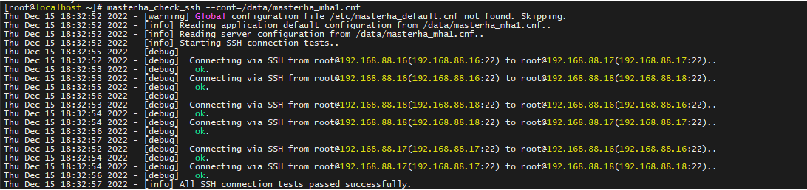
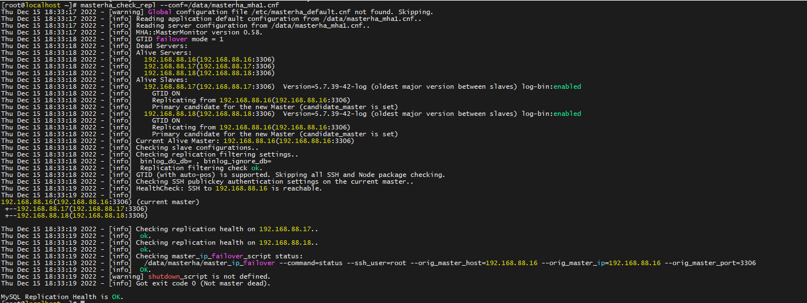
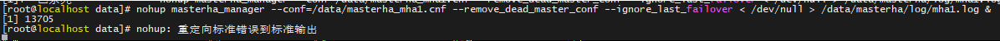

高可用架构：

mha+semi_sync+gtid+vip(mha自带，非keepailved) master-slave1-slave2-manager

master_ip_failover

master_ip_online_change

 

-version

percona-mysql5.7.39 manager-0.58 node-0.58

 

node依赖：

curl -o /etc/yum.repos.d/CentOS-Base.repo http://mirrors.aliyun.com/repo/Centos-7.repo （换源非必要）

yum -y install perl-DBD-MySQL ncftp perl-DBI (node依赖)

rpm -ivh mha4mysql-node-0.58-0.el7.centos.noarch.rpm

yum install -y perl-DBD-MySQL perl-Config-Tiny perl-Log-Dispatch perl-Parallel-ForkManager （manager依赖）

 

--rpm依赖

```sh
rpm -ivh perl-Params-Util-1.07-6.el7.x86_64.rpm perl-Sub-Install-0.926-6.el7.noarch.rpm
rpm -ivh perl-Data-OptList-0.107-9.el7.noarch.rpm
rpm -ivh mha4mysql-node-0.58-0.el7.centos.noarch.rpm
rpm -ivh perl-Params-Util-1.07-6.el7.x86_64.rpm perl-Sub-Install-0.926-6.el7.noarch.rpm
rpm -ivh perl-Data-OptList-0.107-9.el7.noarch.rpm
rpm -ivh perl-Parallel-ForkManager-1.18-2.el7.noarch.rpm
rpm -ivh perl-Module-Runtime-0.013-4.el7.noarch.rpm
rpm -ivh perl-Try-Tiny-0.12-2.el7.noarch.rpm
rpm -ivh perl-Module-Implementation-0.06-6.el7.noarch.rpm
rpm -ivh perl-List-MoreUtils-0.33-9.el7.x86_64.rpm
rpm -ivh perl-Package-DeprecationManager-0.13-7.el7.noarch.rpm
rpm -ivh perl-Package-Stash-XS-0.26-3.el7.x86_64.rpm
rpm -ivh perl-Package-Stash-0.34-2.el7.noarch.rpm
rpm -ivh perl-Class-Load-0.20-3.el7.noarch.rpm
rpm -ivh perl-Email-Date-Format-1.002-15.el7.noarch.rpm perl-MIME-Types-1.38-2.el7.noarch.rpm
rpm -ivh perl-Mozilla-CA-20130114-5.el7.noarch.rpm perl-Net-LibIDN-0.12-15.el7.x86_64.rpm perl-Net-SSLeay-1.55-6.el7.x86_64.rpm
rpm -ivh perl-IO-Socket-IP-0.21-5.el7.noarch.rpm perl-IO-Socket-SSL-1.94-7.el7.noarch.rpm
rpm -ivh perl-Mail-Sender-0.8.23-1.el7.noarch.rpm perl-Mail-Sendmail-0.79-21.el7.noarch.rpm
rpm -ivh perl-Mail-Sendmail-0.79-21.el7.noarch.rpm
rpm -ivh perl-Params-Validate-1.08-4.el7.x86_64.rpm perl-Sys-Syslog-0.33-3.el7.x86_64.rpm
rpm -ivh perl-Data-OptList-0.107-9.el7.noarch.rpm
rpm -ivh perl-TimeDate-2.30-2.el7.noarch.rpm
rpm -ivh perl-Net-SMTP-SSL-1.01-13.el7.noarch.rpm
rpm -ivh perl-MailTools-2.12-2.el7.noarch.rpm
rpm -ivh perl-Log-Dispatch-2.41-1.el7.1.noarch.rpm
rpm -ivh mha4mysql-manager-0.58-0.el7.centos.noarch.rpm
```

--搭建主从基于gtid 命令行

```sh
cd / && mkdir -p data/{mysql_basedir,mysql} && mkdir -p /data/mysql/{data,binlog,readylog,log,mysql_sock,tmp} && touch /data/mysql/log/error.log && chown -R mysql.mysql /data/
tar xf /root/mysql-5.7.39-42-Linux.x86_64.glibc2.17.tar.gz -C /data/mysql_basedir && mv /data/mysql_basedir/Percona*/* /data/mysql_basedir && cd /data/mysql_basedir && ./bin/mysqld --initialize-insecure --user=mysql
cp /data/mysql_basedir/support-files/mysql.server /etc/init.d/mysql && systemctl daemon-reload && systemctl restart mysql
```

```mysql
create user 'trsen'@'192.168.88.%' identified by 'trsen';
grant all privileges on *.* to 'trsen'@'192.168.88.%';

create user 'repl'@'192.168.88.%' identified by 'repl';
grant replication slave on *.* to 'repl'@'192.168.88.%';

change master to master_host='192.168.88.16',master_user='repl',master_password='repl',master_auto_position=1;
```

--mha相关配置

masterha_check_ssh --conf=/data/masterha_mha1.cnf (连接测试)




masterha_check_repl --conf=/data/masterha_mha1.cnf (集群复制状态)



nohup masterha_manager --conf=/data/masterha_mha1.cnf --remove_dead_master_conf --ignore_last_failover < /dev/null > /data/masterha/log/mha1.log & (运行mha)




masterha_check_status --conf=/data/masterha_mha1.cnf (mha status)


--其他相关

/sbin/ip addr add 192.168.88.20/24 dev ens33 label ens33:1(添加VIP、要注意：ens33:1 是要在failover是 做down的。)

/sbin/ip addr del 192.168.88.20/24 dev ens33 label ens33:1(删除)(需要时再用)


--mycnf（本次环境）

```visual basic
Master1
[mysqld]
#basic settings#
basedir   = /data/mysql_basedir
datadir   = /data/mysql/data
socket    = /data/mysql/mysql_sock/mysql.sock
pid-file  = /data/mysql/data/mysql.pid
log-bin   = /data/mysql/binlog/mysql-bin
autocommit=0
transaction_isolation = READ-COMMITTED
explicit_defaults_for_timestamp=ON
log_timestamps=SYSTEM
log_error_verbosity=2
character_set_server=utf8
collation_server=utf8_unicode_ci
symbolic-links=0
server_id=16
#replication settings#
plugin-load='rpl_semi_sync_master=semisync_master.so;rpl_semi_sync_slave=semisync_slave.so'
rpl-semi-sync-master-enabled=1
rpl-semi-sync-slave-enabled=1
log-bin-index=localhost.localdomain-bin.index
log-bin=localhost.localdomain-bin
binlog-format=row
relay_log_purge=off
relay-log-info-repository=table
master-info-repository=table
enforce-gtid-consistency=ON
gtid_mode=ON
[mysqld_safe]
log-error = /data/mysql/log/error.log

[client]
socket    = /data/mysql/mysql_sock/mysql.sock

Slave1
[mysqld]
basedir   = /data/mysql_basedir
datadir   = /data/mysql/data
socket    = /data/mysql/mysql_sock/mysql.sock
pid-file  = /data/mysql/data/mysql.pid
log-bin   = /data/mysql/binlog/mysql-bin
relay_log = /data/mysql/reaylog/mysql-relay-bin
relay_log_index = /data/mysql/reaylog/mysql-relay-bin.index
read_only=on
#basic settings#
autocommit=0
transaction_isolation = READ-COMMITTED
explicit_defaults_for_timestamp=ON
log_timestamps=SYSTEM
log_error_verbosity=2
character_set_server=utf8
collation_server=utf8_unicode_ci
symbolic-links=0
server_id=17
#replication settings#
plugin-load='rpl_semi_sync_master=semisync_master.so;rpl_semi_sync_slave=semisync_slave.so'
rpl-semi-sync-master-enabled=1
rpl-semi-sync-slave-enabled=1
log-bin-index=localhost.localdomain-bin.index
log-bin=localhost.localdomain-bin
binlog-format=row
relay_log_purge=off
relay-log-info-repository=table
master-info-repository=table
enforce-gtid-consistency=ON
gtid_mode=ON
[mysqld_safe]
log-error = /data/mysql/log/error.log

[client]
socket    = /data/mysql/mysql_sock/mysql.sock

Slave2
[mysqld]
basedir   = /data/mysql_basedir
datadir   = /data/mysql/data
socket    = /data/mysql/mysql_sock/mysql.sock
pid-file  = /data/mysql/data/mysql.pid
log-bin   = /data/mysql/binlog/mysql-bin
relay_log = /data/mysql/reaylog/mysql-relay-bin
relay_log_index = /data/mysql/reaylog/mysql-relay-bin.index
read_only=on
#basic settings#
autocommit=0
transaction_isolation = READ-COMMITTED
explicit_defaults_for_timestamp=ON
log_timestamps=SYSTEM
log_error_verbosity=2
character_set_server=utf8
collation_server=utf8_unicode_ci
symbolic-links=0
server_id=18
#replication settings#
plugin-load='rpl_semi_sync_master=semisync_master.so;rpl_semi_sync_slave=semisync_slave.so'
rpl-semi-sync-master-enabled=1
rpl-semi-sync-slave-enabled=1
log-bin-index=localhost.localdomain-bin.index
log-bin=localhost.localdomain-bin
binlog-format=row
relay_log_purge=off
relay-log-info-repository=table
master-info-repository=table
enforce-gtid-consistency=ON
gtid_mode=ON
[mysqld_safe]
log-error = /data/mysql/log/error.log

[client]
socket    = /data/mysql/mysql_sock/mysql.sock
```

--masterha_mha1.cnf

```sh
[server default]
\#log_level=debug
\#MySQL的用户和密码
user=trsen
password=trsen

\#系统ssh用户
ssh_user=root
ssh_port=22

\#复制用户
repl_user=repl
repl_password=repl

\#监控
ping_interval=3
\#shutdown_script=""

\#切换调用的脚本
master_ip_failover_script= /data/masterha/master_ip_failover
master_ip_online_change_script= /data/masterha/master_ip_online_change
\#################################cluster1#############################################
\#mha manager工作目录
manager_workdir = /data/masterha/mha1
manager_log = /data/masterha/log/mha1.log
remote_workdir = /data/masterha/tmp
port = 3306

[server1]
hostname=192.168.88.16
master_binlog_dir = /data/mysql/data/
candidate_master = 1
check_repl_delay = 0 #用防止master故障时，切换时slave有延迟，卡在那里切不过来。

[server2]
hostname=192.168.88.17
master_binlog_dir= /data/mysql/data/
candidate_master=1
check_repl_delay=0

[server3]
hostname=192.168.88.18
master_binlog_dir= /data/mysql/data/
candidate_master=1
check_repl_delay=0
```

--异常插曲

```sh
Last_error 1396 根因 从库已有主库的gtid值
select * from performance_schema.replication_applier_status_by_worker where LAST_ERROR_NUMBER=1396;
mysql> select * from performance_schema.replication_applier_status_by_worker where LAST_ERROR_NUMBER=1396;
+--------------+-----------+-----------+---------------+----------------------------------------+-------------------+----------------------------------------------------------------------------------------------------------------------------------------------------------------------------------------------------------------------------------+----------------------+
| CHANNEL_NAME | WORKER_ID | THREAD_ID | SERVICE_STATE | LAST_SEEN_TRANSACTION                  | LAST_ERROR_NUMBER | LAST_ERROR_MESSAGE                                                                                                                                                                                                               | LAST_ERROR_TIMESTAMP |
+--------------+-----------+-----------+---------------+----------------------------------------+-------------------+----------------------------------------------------------------------------------------------------------------------------------------------------------------------------------------------------------------------------------+----------------------+
|              |         0 |      NULL | OFF           | 3a3076e9-7c3c-11ed-94d6-000c29d8adc1:1 |              1396 | Error 'Operation CREATE USER failed for 'repl'@'192.168.88.%'' on query. Default database: ''. Query: 'CREATE USER 'repl'@'192.168.88.%' IDENTIFIED WITH 'mysql_native_password' AS '*A424E797037BF97C19A2E88CF7891C5C2038C039'' | 2022-12-15 16:29:21  |
+--------------+-----------+-----------+---------------+----------------------------------------+-------------------+----------------------------------------------------------------------------------------------------------------------------------------------------------------------------------------------------------------------------------+----------------------+
1 row in set (0.00 sec)
方法，跳过该gtid事务。执行一个空事务，(要先stop slave)
mysql> set @@session.gtid_next='3a3076e9-7c3c-11ed-94d6-000c29d8adc1:1';
Query OK, 0 rows affected (0.00 sec)
mysql> begin;commit;set @@session.gtid_next=automatic; start slave;
Query OK, 0 rows affected (0.00 sec)
Query OK, 0 rows affected (0.00 sec)
Query OK, 0 rows affected (0.00 sec)
Query OK, 0 rows affected (0.00 sec)
Start slave，即可
```

