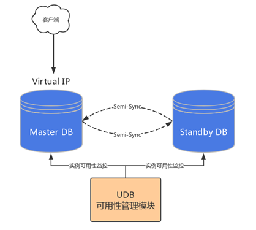

## 1. InnoDB MVCC简述

mvvc全称是multi-version concurrency control（多版本并发控制），主要用于处理读写并发冲突的问题。

原理：

主要依赖于记录中的三个隐藏字段，undolog，read view来实现的。

1. ​	三个隐藏字段：

   **<font color='cornflowerblue'>DB*ROW*ID是数据库默认为该行记录生成的唯一隐式主键，DB*TRX*ID是当前操作该记录的事务ID，DB*ROLL*PTR是一个回滚指针，用于配合undo日志</font>**

   1. DB*TRX*ID： 6字节，最近修改事务id，记录创建这条记录或者最后一次修改该记录的事务id
     2. DB*ROLL*PTR：7字节，回滚指针，指向这条记录的上一个版本,用于配合undolog，指向上一个旧版本
     3. DB*ROW*JD：6字节，隐藏的主键，如果数据表没有主键，那么innodb会自动生成一个6字节的row_id

2. undo log

   当进行update和delete操作的时候，产生的undolog不仅仅在事务回滚的时候需要，在快照读的时候也需要，所以不能随便删除，只有在快照读或事务回滚不涉及该日志时，对应的日志才会被purge线程统一清除（当数据发生更新和删除操作的时候都只是设置一下老记录的deletedbit，并不是真正的将过时的记录删除，因为为了节省磁盘空间，innodb有专门的purge线程来清除deletedbit为true的记录，如果某个记录的deletedid为true，并且DBTRX_ID相对于purge线程的read view 可见，那么这条记录一定时可以被清除的）

3. Read View

   Read View是事务进行快照读操作的时候生产的读视图，在该事务执行快照读的那一刻，会生成一个数据系统当前的快照，记录并维护系统当前活跃事务的id，事务的id值是递增的。

解决了什么问题：提高并发效率

实现：类似于空间换时间的一种思想，就是在某个时间点，把数据作为快照保存下来、也就是一致性视图-ReadView。它保留有关已更改的旧版本信息。

隔离级别：RU、RC、RR、serializable。

RC创建readview时机是每次select都会生成一个新的readview，因为每次select都要返回的是最新一个事务提交后的结果。

RR创建readview时机 只会在第一次执行查询的时候生成一个readview、之后的查询不会再生成readview。


## 2.	InnoDB崩溃恢复流程

当InnoDB正常shutdown，在flush redo log 和脏页后，会做一次完全同步的checkpoint，并将checkpoint的LSN写到ibdata的第一个page中（`fil_write_flushed_lsn`）。在重启实例时，会打开系统表空间ibdata，并读取存储在其中的LSN：

```
        err = srv_sys_space.open_or_create(
        false, &sum_of_new_sizes, &flushed_lsn);
```

上述调用将从ibdata中读取的LSN存储到变量flushed_lsn中，表示上次shutdown时的checkpoint点，在后面做崩溃恢复时会用到。另外这里也会将double write buffer内存储的page载入到内存中(`buf_dblwr_init_or_load_pages`)，如果ibdata的第一个page损坏了，就从dblwr中恢复出来。

> ​	Tips：注意在MySQL 5.6.16之前的版本中，如果InnoDB的表空间第一个page损坏了，就认为无法确定这个表空间的space id，也就无法决定使用dblwr中的哪个page来进行恢复，InnoDB将崩溃恢复失败(bug#70087)， 由于每个数据页上都存储着表空间id，因此后面将这里的逻辑修改成往后多读几个page，并尝试不同的page size，直到找到一个完好的数据页， (参考函数`Datafile::find_space_id()`)。因此为了能安全的使用double write buffer保护数据，建议使用5.6.16及之后的MySQL版本。


## 3. 性能优化

基础优化

>  优化思路: 
>
>  定位问题点吮吸：硬件>系统>应用>数据库>架构(高可用、读写分离、分库分表)。 
>
>  处理方向：明确优化目标、性能和安全的折中、防患未然。 

### **3.1	硬件优化**

#### **3.1.1	主机方面**

根据数据库类型，主机 CPU 选择、内存容量选择、磁盘选择：

- 平衡内存和磁盘资源
- 随机的 I/O 和顺序的 I/O
- 主机 RAID 卡的 BBU(Battery Backup Unit)关闭

#### **3.1.2	CPU 的选择**

CPU 的两个关键因素：核数、主频。根据不同的业务类型进行选择：

- CPU 密集型：计算比较多，OLTP 主频很高的 CPU、核数还要多。
- IO 密集型：查询比较，OLAP 核数要多，主频不一定高的。

#### **3.1.3	内存的选择**

OLAP 类型数据库，需要更多内存，和数据获取量级有关。OLTP 类型数据一般内存是 CPU 核心数量的 2 倍到 4 倍，没有最佳实践。

#### **3.1.4	存储方面**

根据存储数据种类的不同，选择不同的存储设备，配置合理的 RAID 级别(raid5、raid10、热备盘)。

对于操作系统来讲，不需要太特殊的选择，最好做好冗余(raid1)(ssd、sas、sata)。

主机 raid 卡选择：

- 实现操作系统磁盘的冗余(raid1)
- 平衡内存和磁盘资源
- 随机的 I/O 和顺序的 I/O
- 主机 raid 卡的 BBU(Battery Backup Unit)要关闭

#### **3.1.5	网络设备方面**

使用流量支持更高的网络设备(交换机、路由器、网线、网卡、HBA 卡)。注意：以上这些规划应该在初始设计系统时就应该考虑好。

>  服务器硬件优化关键点： 

- 物理状态灯
- 自带管理设备：远程控制卡(FENCE设备：ipmi ilo idarc)、开关机、硬件监控。
- 第三方的监控软件、设备(snmp、agent)对物理设施进行监控。
- 存储设备：自带的监控平台。EMC2(HP 收购了)、 日立(HDS)、IBM 低端 OEM HDS、高端存储是自己技术，华为存储。

### 3.2	系统优化

CPU：基本不需要调整，在硬件选择方面下功夫即可。

内存：基本不需要调整，在硬件选择方面下功夫即可。

SWAP：MySQL 尽量避免使用 Swap。阿里云的服务器中默认 swap 为 0。

IO ：raid、no lvm、ext4 或 xfs、ssd、IO 调度策略。

Swap 调整(不使用 swap 分区)：

```javascript
/proc/sys/vm/swappiness的内容改成0(临时)，/etc/sysctl. conf上添加vm.swappiness=0(永久) 
```

复制

这个参数决定了 Linux 是倾向于使用 Swap，还是倾向于释放文件系统 Cache。在内存紧张的情况下，数值越低越倾向于释放文件系统 Cache。

当然，这个参数只能减少使用 Swap 的概率，并不能避免 Linux 使用 Swap。

修改 MySQL 的配置参数 innodb_flush_ method，开启 O_DIRECT 模式。

这种情况下，InnoDB 的 buffer pool 会直接绕过文件系统 Cache 来访问磁盘，但是 redo log 依旧会使用文件系统 Cache。

值得注意的是，Redo log 是覆写模式的，即使使用了文件系统的 Cache，也不会占用太多。

IO 调度策略：

```javascript
#echo deadline>/sys/block/sda/queue/scheduler 临时修改为deadline 
```

复制

永久修改：

```javascript
vi /boot/grub/grub.conf 
更改到如下内容: 
kernel /boot/vmlinuz-2.6.18-8.el5 ro root=LABEL=/ elevator=deadline rhgb quiet 
```

复制

#### 3.2.1	系统参数调整

Linux 系统内核参数优化：

> ​	文件句柄配置、连接数报错

### 3.3	数据库优化

>  SQL 优化方向：执行计划，索引，SQL 改写
>
>  架构优化方向：高可用架构，高性能架构，分库分表

#### 3.3.1	SQL优化：

先定位具体SQL，然后分析、SQL查询变慢可能有以下几个原因：

1. 索引失效

   1. explain可检验是否使用了索引以及索引的效率如何。如查询没有使用索引或者索引效率低下，可能是因为索引设计不合理或者数据分布不均匀导致索引失效。可考虑优化索引设计，重新构建索引，或调整SQL查询语句以更好地利用索引。也可通过强制指定特定的索引来引导查询优化器选择正确的索引。除了修改索引和SQL语句，还可考虑优化查询条件，避免使用通配符开头的LIKE语句，尽量避免在WHERE子句中对字段进行函数操作，以及尽量减少JOIN操作的复杂度。这些方法都可以帮助提高查询性能和优化索引使用。
   2. explain
      1. 如走了索引Extra中的内容应该是Using index 而不是Using where; Using index
      2. type=index 意味着进行了全索引扫描， 会遍历索引树来查找匹配的行，这个效率比扫表扫描快一些，但是很有限，和我们通常意义上理解的走了索引 是两回事儿。这种情况，大概率是因为没有遵守最左前缀匹配导致的索引失效了。所以需要调整查询语句，或者修改索引来解决。

2. 多表连接

   1. 尽量避免使用子查询、子查询在Mysql5.5版本里，内部执行计划是这样：先查外表再匹配内表，而不是先查内表t2，当外表的数据很大时，查询速度会非常慢。

      在MariaDB10/Mysql5.6版本里，采用join关联方式对其进行了优化，固生产环境应避免使用子查询

      由于MySQL的优化器对于子查询的处理能力比较弱，所以不建议使用子查询，可以改写成`Inner Join`，之所以 join 连接效率更高，是因为 MySQL不需要在内存中创建临时表

   2. Block Nested-Loop Join Algorithm、NL的优化。连接类型为all、index、range、会使用到join buffer 是由参数`join_buffer_size`变量控制、每次连接使用一个join buffer、多表连接可以使用多个；join buffer只存储与查询操作相关的字段数据。

3. 查询字段过多

   1. 避免不必要的字段，需要的字段进行查询。减少数据传输和处理的负担，提高查询效率。
   2. 可以考虑进行分表，即垂直分表，将数据拆分到多个表中。这种方式，可以将数据分散存储在不同的表中，降低单张表的数据量，提升查询性能。需注意：分表可能会引入多表JOIN的问题，因此在进行拆分时需考虑数据冗余的情况。
   3. 还可以考虑通过垂直分表的方式来优化数据存储和查询性能。在拆分表时，需谨慎考虑数据冗余和可能引发的多表JOIN问题，以达到更高效的数据查询和处理。

4. 数据量过大

   1. 数据归档：将历史数据移出主表，数据保留与业务洽谈。可减少单表数据量，提升查询效率。
   2. 分库分表、分区：将数据拆分到多个库、多个表或者进行分区存储。通过分散数据存储的方式，可以有效降低单表数据量，提高查询性能。关于分库分表和分区的详细介绍可以在相关文档中查阅。
   3. 使用第三方数据库：将数据同步到支持大规模查询的分布式数据库中，例如OceanBase、TiDB，或者存储到搜索引擎中，如Elasticsearch等。这些数据库具有更好的扩展性和处理大数据量的能力，可以提升查询效率和系统性能。
   4. 数据量过大的情况，除了建立索引外，还可以通过数据归档、分库分表、分区和使用第三方数据库等方式来优化数据存储和查询性能，以应对大数据量带来的查询效率问题。

5. 索引字段基数太小

   1. 什么时字段基数？
      1. 举个例子，有一个字段它一共在10万行数据里有10万个值对吧？结果呢？这个10万值，要不然就是0，要不然就是1，那么他的基数就是2，为什么？因为这个字段的值就俩选择，0和1。假设你要是针对上面说的这种字段建立索引的话，那就还不如全表扫描了，因为你的索引树里就仅仅包含0和1两种值，根本没法进行快速的二分查找，也根本就没有太大的意义了，所以这种时候，选用这种基数很低的字段放索引里意义就不大了。

6. 数据库连接不足：

   1. 214连接问题 对应文件句柄显示1024问题。与max_connections无关、需配置系统文件句柄。源码在sql/mysqld.cc 关键字 limit= requested_open_files - 10 - TABLE_OPEN_CACHE+MIN * 2

7. 数据库表结构不合理

   1. 索引

   2. 主键

      1. 聚集索引也就是主键索引、innodb所有的表都是索引组织表、主键与数据放在一起、原则如下
         - 创建表时、如果指定了主键、将其作为聚集索引
         - 如果没有指定主键、则选择第一个not null的唯一索引作为聚集索引
         - 如果没有唯一索引、内部会生成一个6字节的rowid作为主键
      2. 二级索引也就是辅助索引、二级索引的叶子节点存储了索引值+rowid(主键值)。二级索引的叶子节点没有存储主键的指针、因为如果主键位置发生变化、则需要修改二级索引的叶子节点对应存储的指针；二级索引的叶子节点本身存储的是主键的值就不会出现此问题。

   3. 基数、选择性、回表

      1. 基数是字段distinct后的值、主键或非null的唯一索引的基数等于表的总行数。

      2. 选择性指的是基数与总行数的比值乘以100%，选择性通常表示字段是否适合创建索引。

         ```sql
         如下sql 用于统计mysql数据库非系统db的全部表/索引信息 
         (包括：数据库、表名、表行数、表大小、索引名、索引字段、基数、选择性比、索引类型..)
         SELECT t.table_schema DB_NAME,
                    t.table_name,
                    -- t.TABLE_COMMENT 表注释,
                    t.TABLE_ROWS,
                    round (sum(DATA_LENGTH / 1024 / 1024 ), 2 ) table_size_MB,
                     -- st.table_id,
                     -- si.index_id,
                    s.index_schema,
                    s.index_name,
                    s.column_name,
                    -- c.COLUMN_COMMENT 列注释,
                    s.Cardinality,
                    concat (round (( CASE
                                   WHEN s.Cardinality = 0 THEN
                                    1
                                   ELSE
                                    s.Cardinality
                                 END ) / (CASE
                                   WHEN t.TABLE_ROWS = 0 THEN
                                    1
                                   ELSE
                                    t.TABLE_ROWS
                                 END ) * 100 ,
                                 2 ),
                           "%") selectivity,
                    s.index_type
               FROM information_schema.TABLES t
               JOIN information_schema.INNODB_SYS_TABLESTATS st
                 ON concat (t.table_schema, "/", t.table_name) = st.NAME
               JOIN information_schema.INNODB_SYS_INDEXES si
                 ON si.table_id = st.table_id
               JOIN information_schema.STATISTICS s
                 ON si.NAME = s.index_name
                AND s.table_name = t.table_name
                AND t.table_schema = s.table_schema
               join information_schema.COLUMNS c
                 on c.COLUMN_NAME = s.column_name
                and c.table_name = t.table_name
                and c.table_schema = s.table_schema
                and t.table_schema not in ( 'test' ,
                                           'mysql' ,
                                           'zabbix' ,
                                           'information_schema' ,
                                           'performance_schema' )
              GROUP BY t.table_schema,
                       t.table_name,
                       t.TABLE_COMMENT,
                       t.TABLE_ROWS,
                       s.index_schema,
                       s.index_name,
                       s.column_name,
                       c.column_COMMENT,
                       s.Cardinality,
                       s.index_type
              ORDER BY ( CASE
                         WHEN s.Cardinality = 0 THEN
                          1
                         ELSE
                          s.Cardinality
                       END ) / (CASE
                         WHEN t.TABLE_ROWS = 0 THEN
                          1
                         ELSE
                          t.TABLE_ROWS
                       END );
         ```

      3. 回表是当查询字段不能在索引完全获得时、需回表查询取出所需数据。

8. SQL导致服务器IO或CPU负载高

   1. CPU

      1. MySQL 5.7 版本起，performance_schema.threads线程表可以查询各个线程的信息，THREAD_OS_ID值对应OS中的线程，这就为故障定位提供了便捷，SQL如下：
      2. top -H -u MySQL

      ```sql
      select t.THREAD_ID, t.PROCESSLIST_ID, t.THREAD_OS_ID, t.PROCESSLIST_USER, t.PROCESSLIST_HOST, t.PROCESSLIST_DB, t.PROCESSLIST_TIME, t.PROCESSLIST_STATE, esc.SQL_TEXT
      from performance_schema.threads t join performance_schema.events_statements_current esc on t.THREAD_ID = esc.THREAD_ID
      where t.THREAD_OS_ID = ?
      ```

   2. IO

      1. iotop -ou mysql 便捷sql如上

9. 数据库参数设置不合理

10. 长时间事务

11. 锁竞争导致的等待

12. 区分in和exists主要是造成了驱动顺序的改变（这是性能变化的关键），如果是exists，那么以外层表为驱动表，先被访问，如果是IN，那么先执行子查询。所以IN适合于外表大而内表小的情况；EXISTS适合于外表小而内表大的情况。

    另外，in查询在某些情况下有可能会查询返回错误的结果，因此，通常是建议在确定且有限的集合时，可以使用in。如 IN （0，1，2）。

https://developer.aliyun.com/article/1008410

https://developer.aliyun.com/article/1459310?spm=a2c6h.12873639.article-detail.54.50691c0f2uuKX6


SQL：https://developer.aliyun.com/article/1459310?spm=a2c6h.12873639.article-detail.54.50691c0f2uuKX6
performance：https://cloud.tencent.com/developer/article/1921568


#### 3.3.2	数据库参数优化：

**①调整**实例整体(高级优化，扩展)：

```javascript
thread_concurrency：# 并发线程数量个数 
sort_buffer_size：# 排序缓存 
read_buffer_size：# 顺序读取缓存 
read_rnd_buffer_size：# 随机读取缓存 
key_buffer_size：# 索引缓存 
thread_cache_size：# (1G—>8, 2G—>16, 3G—>32, >3G—>64) 
```

复制

②连接层(基础优化)**设置合理的连接客户和连接方式：

```javascript
max_connections # 最大连接数，看交易笔数设置 
max_connect_errors # 最大错误连接数，能大则大 
connect_timeout # 连接超时 
max_user_connections # 最大用户连接数 
skip-name-resolve # 跳过域名解析 
wait_timeout # 等待超时 
back_log # 可以在堆栈中的连接数量 
```

复制

**③SQL 层(基础优化)**

query_cache_size： 查询缓存 >>> OLAP 类型数据库，需要重点加大此内存缓存，但是一般不会超过 GB。

对于经常被修改的数据，缓存会马上失效。我们可以使用内存数据库(redis、memecache)，替代它的功能。

#### 3.3.3	存储引擎层（innodb）优化：

innodb 基础优化参数：

```javascript
default-storage-engine 
innodb_buffer_pool_size # 没有固定大小，50%测试值，看看情况再微调。但是尽量设置不要超过物理内存70% 
innodb_file_per_table=(1,0) 
innodb_flush_log_at_trx_commit=(0,1,2) # 1是最安全的，0是性能最高，2折中 
binlog_sync 
Innodb_flush_method=(O_DIRECT, fdatasync) 
innodb_log_buffer_size # 100M以下 
innodb_log_file_size # 100M 以下 
innodb_log_files_in_group # 5个成员以下,一般2-3个够用（iblogfile0-N） 
innodb_max_dirty_pages_pct # 达到百分之75的时候刷写 内存脏页到磁盘。 
log_bin 
max_binlog_cache_size # 可以不设置 
max_binlog_size # 可以不设置 
innodb_additional_mem_pool_size #小于2G内存的机器，推荐值是20M。32G内存以上100M 
```

### 3.4	OS诊断

1. top 主机负载情况
   1. top -H -u mysql 线程模式

2. dmesg | tail 是否存在oom-killer 或 tcp drop等错误信息
3. vmstat 1 检查r、free、si、so、us, sy, id, wa, st列
4. mpstat -P ALL 1 检查CPU使用率是否均衡
5. pidstat 1 检查进程的cpu使用率、多核利用情况
6. iostat -xz 1 检查r/s, w/s, rkB/s, wkB/s, await, avgqu-sz, %util
7. free -m 检查内存使用情况
8. sar -n DEV 1 检查网络吞吐量
   1. sar -n TCP,ETCP 1 检查tcp连接情况active/s, passive/s, retrans/s 

## 4. 备份

### 4.1	Percona XtraBackup 2.4：

大致流程是 会复制Innodb数据文件 同时有两个步骤：1检查数据文件 2检查事务日志；XtraBackup通过记住日志序列号（LSN）来工作 然后拷贝数据文件，拷贝过程中XtraBackup后台会运行一个进程 监控事务日志、并从复制文件中更改，XtraBackup需要不断地这样做，因为事务日志是以循环方式写入的，并且可以重用；XtraBackup需要自开始执行以来对数据文件的每次更改的事务日志记录。

1. start backup
2. copy ibdata1 / copy .ibd file
3. Excuted ftwrl
4. backup non-InnoDB tables and files
5. Writing xtrabackup_binlog_info
6. Executed FLUSH NO_WRITE_TO_BINLOG ENGINE LOGS
7. Executed UNLOCK TABLES
8. Copying ib_buffer_pool
9. completed OK!

Xtrabackup 2.4 在执行 ftwrl 并备份完所有非 InnoDB 表格的文件后通过 show master status 获取了 binlog position 和 GTID 的信息，将其记录到 xtrabackup_binlog_info 文件中.

**那么 show master status 获取的是哪些信息？**

命令提供实例的 binlog 文件的状态信息，显示正在写入的 binlog 文件，以及当前的 binlog position， 并且 MySQL 5.7 在 MySQL 库下引入了 gtid_executed 表，该表会记录当前执行过的 GTID。

表格虽然 是 InnoDB 表，但是其中的数据并非是实时更新的，且该表格记录信息的方式存在以下两个情况：

- 如果禁用了 log_bin，实例不会在该表格记录任何信息；若从库的 log_slave_updates 为 OFF，那么从 库会在应用 relay-log 中的每个事务时执行一次 insert mysql.gtid_executed 的操作。 
- 如果启用了 log_bin，则该表格记录的是在 binlog 发生切换（rotate）的时候直到上一个 binlog 文件 执行过的全部 GTID，而此时 show master status 获取的 Gtid 信息不再由 mysql.gtid_executed 表提 供，而是由全局系统变量 gtid_exected 提供；如果服务器意外停止，则当前 binlog 文件中的 Gtid 集合不会保存在 mysql.gtid_executed 表中，在实例恢复期间，这些 Gtid 从 binlog 文件中读取并添 加到表中。

### 4.2 XtraBackup 8.0：

大致如下：

1. start backup
2. copy .ibd file
3. backup non-InnoDB tables and files
4. Executed FLUSH NO_WRITE_TO_BINLOG BINARY LOGS
5. Selecting LSN and binary log position from p_s.log_status
6. copy last binlog file
7. Writing /mysql/backup/backup/binlog.index
8. Writing xtrabackup_binlog_info
9. Executing FLUSH NO_WRITE_TO_BINLOG ENGINE LOGS
10. copy ib_buffer_pool
11. completed OK!

percona 官方 文档的信息，当 MySQL 8.0 中仅存在 InnoDB 引擎的表格时，不再执行 ftwrl（当存在非 InnoDB 的表格 或者使用 --slave-info 选项时会执行），而是根据上述步骤的第 5 步，Xtrabackup 8.0 会通过 SELECT server_uuid, local, replication, storage_engines FROM performance_schema.log_status 来获取 LSN 、binlog position and Gtid。


### 4.3 备份相关问题：

其一：redolog过小

```sql
2021-01-07 06:25:31.882@localhost.localdomain@6709@LM_DEBUG@agent|xtrabackup: error: log block numbers mismatch:
2021-01-07 06:25:31.882@localhost.localdomain@6709@LM_DEBUG@agent|xtrabackup: error: expected log block no. 100042871, but got no. 103114859 from the log file.
2021-01-07 06:25:31.882@localhost.localdomain@6709@LM_DEBUG@agent|xtrabackup: error: it looks like InnoDB log has wrapped around before xtrabackup could process all records due to either log copying being too slow, or  log files being too small.
2021-01-07 06:25:35.467@localhost.localdomain@6709@LM_DEBUG@agent|xtrabackup: Error: xtrabackup_copy_logfile() failed.
```

log block numbers mismatch，大概的意思是说：XtraBackup在顺序拷贝完redo log末尾的数据后，重新从redo log的起始位置去拷贝时，发现起始位置的log block no.与刚才尾部的no.不连续。

要么xtrabackup读取redo的速度太慢了，或者redo 文件太小了，导致读取速度跟不上redo文件的切换速度，在读取之前，相应的redo块已经被覆盖了。

查看校验redo参数

```sql
innodb_log_file_size=
innodb_log_files_in_group=
```


其二：without redo logging

FATAL InnoDB: An optimized(without redo logging) DDLoperation has been performed. All modified pages may not have been flushed to the disk yet. 

PXB will not be able take a consistent backup. Retry the backup operation 

MySQL 5.7 中给表加字段属于 ONLINE DLL ，会重建表，但允许并发 DML（PS：MySQL 8.0 加字段不需要重建表）

由于 MySQL 采用的是索引组织表（IOT），表上的索引当然也需要重建，由于采用了 ALGORITHM=INPLACE 的方式，允许并发 DML

在 MySQL 5.7 中，对索引有一个优化，即<font color='cornflowerblue'> Sorted Index Builds </font>，会在创建或重建索引的时候通过 bulk load 、bottom-up 的方式来填充索引记录

<font color='red'>采用 Sorted Index Build 方式创建索引时，不会记录到 redo 日志中</font>，而这就是之前 Xtrabackup 报错中所描述的“An optimized(without redo logging) DDL operation”的场景

Percona 称这是 Xtrabackup 2.4.x 的一个 bug ，主要是为了避免得到一个错误的备份集，一旦检测到有不记录 redo 的 DDL 操作，就会将备份进程终止，而客户生产环境中的 PXB 版本正是2.4.5 


其三：拿不到锁 超时

```sql
2021-07-16 06:01:33.761@shlipei-db1-cao@4821@LM_DEBUG@agent|Error: failed to execute query 'FLUSH NO_WRITE_TO_BINLOG TABLES': 1205 (HY000) Lock wait timeout exceeded; try restarting transaction
2021-07-16 06:01:33.885@shlipei-db1-cao@4821@LM_DEBUG@agent|210716 06:01:33 >> log scanned up to (234756331139)
2021-07-16 06:01:34.837@shlipei-db1-cao@4821@LM_ERROR@agent|Failed to execute xtrabackup program
2021-07-16 06:01:34.840@shlipei-db1-cao@4821@LM_ERROR@agent|Failed to make mysql hot backup
```

- `FLUSH NO_WRITE_TO_BINLOG TABLES的作用是：` 关闭所有打开的表，强制关闭所有正在使用的表，并刷新查询缓存和预准备语句缓存。还会从查询缓存中删除查询结果。默认情况下flush语句会写入binlog，这里使用no_write_to_binlog禁止记录。查看Binlog发现，binlog内真的啥都没记录。


## 5. 变更（DDL相关）

### 5.1 ghost：

以与原始表相似的方式创建幽灵表，将数据从原始表缓慢且增量地复制到幽灵表，同时应用正在进行的更改（INSERT，DELETE，UPDATE）到幽灵表。最后，在适当的时候，它用幽灵表替换了原始表。**gh-ost** 使用相同的模式。但是，它与所有现有工具的不同之处在于不使用触发器。取而代之的是，**gh-ost** 使用二进制日志流捕获表的更改，然后将其异步应用到幽灵表。

流程如下：

1. 先查验binlog以及position点位；
2. migrating new table _gho；
3. 校验参数、也许参数校验在第一步之前也就是预开始环节进行校验；预校验或许是第一步参数的准确性、其二也就是这一步是参数的意义。
4. 生成两个文件 节流文件以及迁移交换文件 或者是延迟迁移文件、终止文件三者文件对应sock；
5. 开始数据copy migrating；
6. 等待转换完成、State: postponing cut-over;
7. 删除创建的标志文件，标志文件为 --postpone-cut-over-flag-file、或者进行交互命令 echo "unpostpone" |nc -U ***.sock
8. 日志输出、转换完成。

> ​	这里讲下关于ghost 'Waiting for table metadata lock'的问题，ghost锁机制相比于 pt-online-schema-change更加灵活。利用ghost做DDL迁移时，无论此时涉及的表是否有事务运行中 都能一如既往的进行数据转换、当数据转换完成时，事务若还在继续执行中，此刻进行unpostpone时ghost输出日志会爆出一条 MySQL相关 1205的错误，即锁超时，只需等待事务执行完毕后进行转换即可，也可以直接终结事务进行转换收尾工作。ghost执行前也好、执行中也好 期间大事务的存在影响不是很大。

<font color='red'>gh-ost丢数据原因</font>
应该和两阶段提交有关，两阶段提交先写redo log设置prepare阶段，再写binlog，最后将redo log设置为commit状态。
在写完binlog，没标记redo log commit状态的时候，启动gh-ost，完成binlog监听，select最大最小边界值，就会出现丢数据。
和主从同步关系应该不大。即使没有从库，也会丢数据的。  
<font color='cornflowerblue'>--当使用 gh-ost 时，它会监听 binlog，捕获表的变更，并将这些变更应用到目标表中。
--然而，在某些情况下，如果在 binlog 中的事务已经被标记为提交，但是在 gh-ost 启动前，
--该事务的 binlog 还未被读取和应用，那么在执行完 gh-ost 后，这些事务就会被遗漏，导致数据丢失。</font>
不过加共享锁，确实可以解决这个问题。

### 5.2 pt-online-schema-change：

​	简述：该工具是著名开源公司percona研发出的一套关于MySQL维护工具（percona-toolkit）中其中的一环。其他工具很多也很实用，本章只谈pt-online-schema-change。

​	原理：pt-online-schema-change会在涉及变更表基础上新增一个表且打个标记、在新表做DDL操作，然后会创建三个触发器分别对应DML操作，全量数据copy完成后，期间全量数据任何变更运作到触发器进行完善增量数据，最后原始表rename，新的幽灵表renema原始表，做收尾工作，删除表以及触发器，最后完成。

流程如下：

1. create new table；
2. alter new table；
3. alter end；
4. create triggers ... ；
5. copy数据、pt-online-schema-change涉及运行的insert -- <u>insert low_priority ignore into</u>.. 跟ghos不通 pt-online-schema-change多了参数LOW_PRIORITY、参数会导致执行顺序为低级、也就是说会等待其他非LOW_PRIORITY的读写操作完成后才执行，是为了减少锁竞争。个人角度而言可能是走触发器的原因所采用此参数。
6. copy完成后 会analyz 做优化表操作。
7. sawpping new table && swapped original
8. drop 、old table triggers；
9. successfully altered

> pt-online-schema-change有个问题、如果再执行前有一个大事务 pt-online-schema-change在create trigger时 会卡死、即 metadata lock、直到事务完成或者超时释放连接，才会执行以下操作。所以说 整体灵活性卡的很死、生产建议用ghost。


### 5.3 算法原理

**copy 算法**
较简单的实现方法，MySQL 会建立一个新的临时表，把源表的所有数据写入到临时表，在此期间无法对源表进行数据写入。MySQL 在完成临时表的写入之后，用临时表替换掉源表。这个算法主要被早期（<=5.5）版本所使用。

**inplace 算法**
从 5.6 开始，常用的 DDL 都默认使用这个算法。inplace 算法包含两类：inplace-no-rebuild 和 inplace-rebuild，两者的主要差异在于是否需要重建源表。

inplace 算法的操作阶段主要分为三个：

Prepare阶段： 

创建新的临时 frm 文件(与 InnoDB 无关)。 - 持有 EXCLUSIVE-MDL 锁，禁止读写。 - 根据 alter 类型，确定执行方式（copy，online-rebuild，online-not-rebuild）。 更新数据字典的内存对象。 - 分配 row_log 对象记录数据变更的增量（仅 rebuild 类型需要）。 - 生成新的临时ibd文件 new_table（仅rebuild类型需要）。
Execute 阶段：
	降级EXCLUSIVE-MDL锁，允许读写。
	扫描old_table聚集索引（主键）中的每一条记录 rec。
	遍历new_table的聚集索引和二级索引，逐一处理。
	根据 rec 构造对应的索引项。
	将构造索引项插入 sort_buffer 块排序。
	将 sort_buffer 块更新到 new_table 的索引上。
	记录 online-ddl 执行过程中产生的增量（仅 rebuild 类型需要）。
	重放 row_log 中的操作到 new_table 的索引上（not-rebuild 数据是在原表上更新）。
	重放 row_log 中的DML操作到 new_table 的数据行上。
Commit阶段：
	当前 Block 为 row_log 最后一个时，禁止读写，升级到 EXCLUSIVE-MDL 锁。
	重做 row_log 中最后一部分增量。
	更新 innodb 的数据字典表。
	提交事务（刷事务的 redo 日志）。
	修改统计信息。
	rename 临时 ibd 文件，frm文件。
	变更完成，释放 EXCLUSIVE-MDL 锁。

instant 算法
	MySQL 8.0.12 才提出的新算法，目前只支持添加列等少量操作，利用 8.0 新的表结构设计，可以直接修改表的 metadata 数据，省掉了 rebuild 的过程，极大的缩短了 DDL 语句的执行时间。

## 6. HA

### 6.1 MHA master crash：

第一步：检查配置
binlog server
 1.检查ssh连通性
 2.获取node版本 get_node_version --apply_diff_relay_logs --version
 3.拿到版本号可达binlog server 否则不可达
	1.检查mha版本信息
		result1:没有安装mha
		result2::node version 版本号必须等于或者高于0.54
		检查每个实例是否可以连接
		每个节点的死活状态
		查看slave_io_running 是否为yes 不然则启动sql thread

第二步：关闭当前crash io线程、并执行脚本切换VIP
判断ssh是否可达
 停止所有slave 复制io线程
 执行配置文件中的master_ip_failover_script/shutdown_script 若没有则不执行
 如果设置了VIP，则首先切换VIP
 如果设置了shutdown脚本，则执行shutdown脚本

第三步：新主恢复
获取新的主从信息
 获取各个slave的binlog file 和 position 点
 执行 show slave status 获取从库信息 --其中重要信息参数
 $target->{Relay_Master_Log_File} = $status{Relay_Master_Log_File};
 $target->{Exec_Master_Log_Pos} = $status{Exec_Master_Log_Pos};
 $target->{Relay_Log_File} = $status{Relay_Log_File};
 $target->{Relay_Log_Pos} = $status{Relay_Log_Pos};
  比较各个slave 中的 master_log_file 和 read_master_logs_pos，寻找laster的 slave
  比较各个slave 中的 master_log_file 和 read_master_logs_pos，寻找oldest的 slave
   if ( !$_server_manager->is_gtid_auto_pos_enabled() ) {..
    进行binlog补充
	判断dead msater 是否可以ssh连接
	 如果dead msater 可以ssh连接
	 使用node节点的save_binary_logs脚本在dead master做拷贝
	 拷贝binlog文件到manage节点的manager_workdir目录下 ，如果dead master无法ssh登录，则master上未同步到slave的txn丢失
	确定新主
	 寻找最新的有所有中继日志的slave，用于恢复其他slave
	#my $latest_base_slave = find_latest_base_slave_internal();
	#my $oldest_mlf = $oldest_slave->{Master_Log_File};
	#my $oldest_mlp = $oldest_slave->{Read_Master_Log_Pos};
	#my $latest_mlf = $latest_slaves[0]->{Master_Log_File};
	#my $latest_mlp = $latest_slaves[0]->{Read_Master_Log_Pos};
	 ..
	  判断latest和oldest slave 上的binlog位置是不是相同、相同就不需要同步relay log
	  查看laster slave中是否有oldest缺少的relay log、若无则继续，否则failover失败
	  查找的方法：逆序的读laster slave的relay log文件、一直找到binlog file的position为止
	  选出新的master节点
	  比较master_log_file:read_master_log_pos
	  识别优先从库、在线的并带有candidate_master标记
	  识别应该忽略的从库，带有no_master标记、或者未开启log_bin 、与最新从库想必数据延迟比较大 --slave 与 master的binlog position差距大于100000000
	  选择优先级依次为：优先列表、最新从库列表、所有从库列表、但一定排除忽略列表
	  检查新老主库的复制过滤是否一致
    恢复从库 类似单独灰度主库过程
	中继补偿（生成slave与new slave之间的差异日志，将该日志拷贝到各个slave的工作目录下）指向新主库&启动复制（change_master_and_start_slave)清理新主库的slave复制通道 reset slave all


### 6.2 mha原理

MHA 选主逻辑：
1. 选举优先级最高的 slave 作为新主（通常是手工切换指定的new master），如果该slave 不能作为新主，则报错退出，否则如果是故障切换，则进行下面的步骤
2. 选择复制位点最新并且在设置了 candidate_master 的 slave 作为新主，如果复制位点最新的 slave 没有设置 candidate_master ，则继续下面步骤
3. 从设置了 candidate_master 中选择一个 slave 作为新主，如果没有选出则继续
4. 选择复制位点最新的 slave 作为新主，如果没有选出则继续
5. 从所有的 slave 中进行选择
6. 经过以上步骤仍然选择不出主则选举失败
注意：前面的 6 个选举步骤，都需要保证新主不在 bad 数组中

MHA，全称Master High Availability，是一款开源的MySQL高可用性解决方案。它的主要功能是在主节点故障时自动进行故障转移，以保证数据的高可用性和系统的连续性。本文将详细解析MHA的工作原理和使用方法。

1. MHA的工作原理可以概括为以下几点：
2. 监控：MHA持续监控MySQL主从复制的状态，以便及时发现和处理故障。
3. 故障检测：当MHA检测到主节点故障时，它会启动故障转移过程。
4. 选主：MHA会选择一个从节点作为新的主节点，这个节点拥有最新的数据。
5. 数据同步：MHA会将其他从节点的数据同步到新的主节点，确保数据一致性。
6. 切换：MHA会将所有对主节点的请求重定向到新的主节点，完成故障转移。

KEEPALIVED LVS

