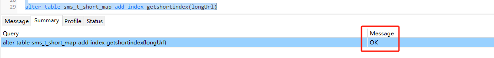
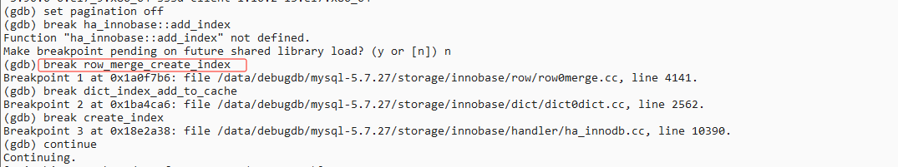

#### 索引字节限制

需求：增加getshortindex联合索引，information_schema看了大致数据量、alter语句捞了一眼 没什么问题，于是直接运行 报错，，


##### 问题追溯：

经查验、该版本是MySQL 5.6 需查看索引限制参数
服务器参数都是默认参数、也就是说从参数来看索引字节最大只能走767字节、超过就会报错如上图。


复现，将参数改为一致、alter 单个字段（255）default null ---> longurl

```sql
SET GLOBAL innodb_large_prefix='OFF';
SET GLOBAL innodb_file_format='Antelope';
```



？OK 继续看，经官方文档校验、MySQL 索引字节限制只能走767，可复现时 是可以的，768是错误的？*（255*3+1+2）=768、utf8*

再次复现 varchar(255) 改为256进行加索引尝试：

*innodb*索引长度计算公式：Character Set：utf8mb4=4,utf8=3,gbk=2,latin1=1) * 列长度 + 1(允许 Null) + 2(变长列)


<font color='red'>1071 - Specified key was too long; max key length is 767 bytes</font>

ok，经过验证，上述 768是错误的，正确的长度是**765.**

起一个debug版本 打上断点，后 让数据库继续跑

gdb -p pid..  




起另一个窗口 ALTER TABLE c ADD INDEX c(longUrl);  会命中断点

```sql
(gdb) continue
Continuing.
[Switching to Thread 0x7f036c478700 (LWP 21837)]

Breakpoint 1, row_merge_create_index (trx=0x7f03830d0d08, table=0x7f033002c330, index_def=0x7f0330945b50, add_v=0x0) at /data/debugdb/mysql-5.7.27/storage/innobase/row/row0merge.cc:4141
4141            ulint           n_fields = index_def->n_fields;
```

相关调试如下：

```sql
(gdb) p index_def->n_fields #表示这个索引包含多少列字段
$1 = 1
(gdb) p index_def->fields[0]->prefix_len #表示索引列没有前缀长度，即整个列都被索引
$2 = 0
(gdb) p index_def->fields[0]->prefix_len
$3 = 0
(gdb) ptype index_def->fields[0]
type = struct index_field_t {
    ulint col_no;
    ulint prefix_len;
    bool is_v_col;
}
(gdb) p index_def->fields[0]->len
There is no member named len.
(gdb) ptype index_def->fields[0]
type = struct index_field_t {
    ulint col_no;
    ulint prefix_len;
    bool is_v_col;
}
(gdb) p *index_def->fields[0]
No symbol "operator*" in current context.
(gdb) p table->cols[index_def->fields[0]->col_no]->len    #从表列获取长度 
$5 = 765
(gdb) p table->cols[index_def->fields[0]->col_no]->prtype
$6 = 2166799
(gdb) p table->n_cols   #查看表列数
$7 = 16
(gdb) p table->cols[0]
$8 = {prtype = 1283, mtype = 6, len = 4, mbminmaxlen = 0, ind = 0, ord_part = 1, max_prefix = 0}

```

`col_no` 表示索引字段在表中的列序号。

`table->cols[col_no]` 对应 **实际列对象 (`dict_col_t`)**。

`.len = 765` 表示这个列的最大长度是 765 字节。
