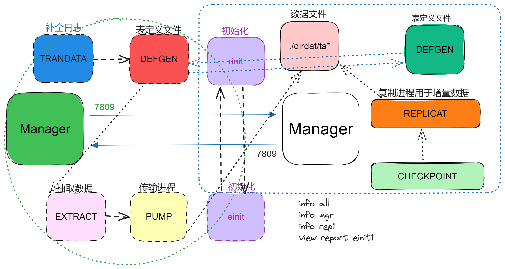
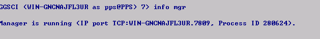
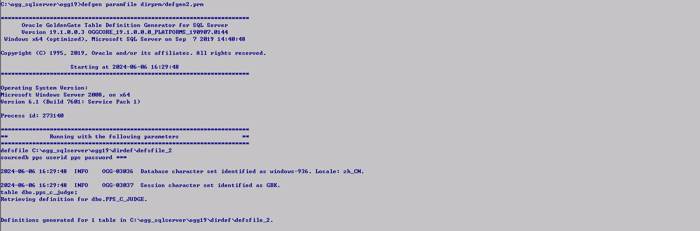

### OGG SQLServer—>MySQL

安装简述：[Oracle GoldenGate Downloads](https://www.oracle.com/middleware/technologies/goldengate-downloads.html)	windows linux 上传附件包进行解压即可。

表结构处理：https://www.sqlines.com/online

SQLSERVER CDC：

SQLSERVER 2012 与OGG12 版本不兼容问题 [ERROR OGG-05253] - Invalid object name 'goldengate.OracleGGCleanupJobStatus'. (文档 ID 2382734.1)

沿用ogg中ogg_cdc_cleanup_setup.bat手动创建启动oggjob

EXECUTE sys.sp_cdc_drop_job 'cleanup' #删除数据库的SQL Server cdc.dbname_cleanup作业

启用：

EXEC sys.sp_cdc_enable_table @source_schema = N'dbo',@source_name = N'PPS_C_JUDGE',@role_name = NULL;

手动创建启动OGG job创建：


--------------------------------------------------------------------------------------------------------------------------------------------------------------------------



---------------------------------------------------------------------------------------------------------------------------------

各进程阐述：

- Manager进程：需要源端跟目标端同时运行，主要作用是监控管理其它进程，报告错误，分配及清理数据存储空间，发布阈值报告等
- Extract进程：运行在数据库源端，主要用于捕获数据的变化，负责全量、增量数据的抽取
- Trails文件：临时存放在磁盘上的数据文件
- Data Pump进程：运行在数据库源端，属于Extract进程的一个辅助进程，如果不配置Data Pump，Extract进程会将抽取的数据直接发送到目标端的Trail文件，如果配置了Data Pump，Extract进程会将数据抽取到本地Trail文件，然后通过Data Pump进程发送到目标端，配置Data Pump进程的主要好处是即使源端到目标端发生网络中断，Extract进程依然不会终止
- Collector进程：接收源端传输过来的数据变化，并写入本地Trail文件中
- Replicat进程：读取Trail文件中记录的数据变化，创建对应的DML语句并在目标端回放


解压初始化：

1.  `CREATE SUBDIRS` 创建 Oracle GoldenGate 安装目录中的默认子目录（源端和目标端）

2.  数据源配置 SQLServer <font color='red'>ODBC </font>连接，（MSSQL需，MySQL无需）

3.  配置mgr （源端和目标端）

    ```sql
    edit params dirprm/mgr.prm #初始化创建配置
    -- #源
    port 7809
    PURGEOLDEXTRACTS C:\ogg_sqlserver\ogg19\dirdat\*, USECHECKPOINTS, MINKEEPDAYS 2
    AUTORESTART EXTRACT *, RETRIES 3, WAITMINUTES 5, RESETMINUTES 60
    AUTORESTART REPLICAT *, RETRIES 3, WAITMINUTES 5, RESETMINUTES 60
    ACCESSRULE, PROG *, IPADDR *, ALLOW
    -- #目标
    port 7809
    PURGEOLDEXTRACTS ./dirdat/*, USECHECKPOINTS, MINKEEPDAYS 2
    AUTORESTART EXTRACT *, RETRIES 3, WAITMINUTES 5, RESETMINUTES 60
    AUTORESTART REPLICAT *, RETRIES 3, WAITMINUTES 5, RESETMINUTES 60
    ACCESSRULE, PROG *, IPADDR *, ALLOW
    
    --- #配置全局变量
    edit params ./GLOBALS
    -- #源
    MGRSERVNAME GGSMGR_SQLSERVER
    GGSCHEMA dbo  #dbo是 schema 不是库名
    -- #目标
    checkpointtable testdb.checkpoint #目标端mysql 是为了后续日志点表 详情后文会阐述
    
    SQLSERVER服务器 在ogg目录 安装服务 install.exe addservice 我的流程是 1.install.exe addservice 2.edit params GLOBAL 3.install.exe addservice 最后出现GGSMGR_SQLSERVER服务 等于是两个服务 GGSMGR|GGSMGR_SQLSERVER 最终体现是 GGSMGR_SQLSERVER 启动中.. 后续详细阐述区别（待完）
    
    ###注意 目标端 端口 放开，防火墙关闭 否则报错 ogg-01224
    ```

    上述配置完成后：

   ```sql
   start mgr
   info all #查看所有进程
   info mgr #查看mgr进程相关 最终运行成功即可
   ```

    

4.  配置 SQLSERVER 抽取进程 ext1

    ```sql
    edit params ext1 #编辑初始化
    ---
    EXTRACT ext1 #定义抽取进程
    SOURCEDB pps, USERID pps, PASSWORD Password001 #源端odbc即可
    EXTTRAIL ./dirdat/ta #指定抽取增量数据写入该目录
    DYNAMICRESOLUTION #动态解析
    GETTRUNCATES #捕获截断(truncate)操作
    TABLE dbo.pps_c_judge; #抽取数据表
    ---
    保存即可
    add extract ext1,tranlog,begin now  #创建extract进程
    add exttrail ./dirdat/ta,extract ext1 #添加exttrail
    ```

5.  配置 SQLSERVER 传输进程 pump

    ```sql
    edit params pump1 #编辑初始化
    ---
    extract pump1 #定义传输进程
    rmthost 172.18.100.59,mgrport 7809 #目标端服务器，以及mgr端口（7809）
    rmttrail /data/ogg/dirdat/ta #将增量数据文件传输到目标端目录
    passthru #直通模式、Pump进程将数据直接传递给目标端
    gettruncates #捕获截断（truncate）操作
    table dbo.pps_c_judge; #传输数据的表(源端表)
    ---
    保存即可
    add extract pump1,exttrailsource ./dirdat/ta #添加pump进程 且从指定目录读取数据 Pump 进程负责将 Extract 进程捕获的数据传输到目标系统
    add rmttrail /data/ogg/dirdat/ta,extract pump1 #添加远程轨迹文件
    ```

6.  配置 SQLSERVER 定义文件

    ```sql
    edit params defgen1 #编辑初始化
    ---
    defsfile C:\ogg_sqlserver\ogg19\dirdef\defsfile_1 #定义生成文件目录
    sourcedb pps userid pps password Password001 #数据源
    table dbo.pps_c_judge; #传输数据的表(源端表)
    ---
    保存即可
    ogg目录运行：
    defgen paramfile dirprm/defgen1.prm #生成表定义 复制到目标端dirdef下 内容文件名且一致
    ```

   

7.  配置 SQLSERVER 初始化进程

    ```sql
    edit param einit1 #编辑初始化
    ---
    extract einit1 #定义初始化进程
    sourcedb pps userid pps password Password001 #源端数据源odbc
    rmthost 172.18.100.59,mgrport 7809 #目标端服务器 mgr端口
    rmttask replicat, group rinit1 #配置 Extract 或 Pump 进程与 Replicat 进程之间的任务定义 与目标端衔接
    table dbo.pps_c_judge; #传输数据的表(源端表)
    ---
    保存即可
    add extract einit1, sourceistable #添加初始化进程 初始化进程运行结束会自行停止
    ```

8.  配置 MySQL 初始化进程

    ```sql
    edit param rinit1 #初始化编辑
    ---
    replicat rinit1 #进程定义
    targetdb testdb@172.18.100.59:3306 userid testdb password Password001 #目标端数据源
    sourcedefs /data/ogg/dirdef/defsfile_1 #目标端表定义路径
    discardfile /data/ogg/dirrpt/rinit.dsc, purge #丢弃文件  记录 Replicat 进程在处理事务时遇到的错误数据行和相关的错误信息
    map dbo.pps_c_judge, target testdb.pps_c_judge; #map源端表 target目标端表
    ---
    保存即可
    add replicat rinit1,specialrun #创建 Replicat 进程。进程在处理完任务后自动停止
    ```

9.  源端SQLSERVER 进行初始化 

    ```sql
     start einit1 
     view report rinit1 #查看初始化日志
     最终显示如图下 初始化完成。
    ```

   

10.  配置 MySQL 复制进程 即增量数据实时同步

     ```sql
     edit params rep1 #编辑初始化
     ---
     replicat rep1 #定义进程
     sourcedefs /data/ogg/dirdef/defsfile_1 #表定义
     targetdb testdb@172.18.100.59:3306 userid testdb password Password001 #目标端数据源
     reperror default, discard  #Replicat 进程在遇到任何错误时，将错误数据记录到丢弃文件（discard file）
     NODISCARDFILE #Replicat 进程在遇到错误数据时不会将其记录到丢弃文件中。
     gettruncates #Replicat 进程中启用截断操作的处理
     map dbo.pps_c_judge, target testdb.pps_c_judge; #map 源端表 target 目标端
     ---
     保存即可
     可不运行、待全量初始化完成后 运行 复制进程
     ```

11.  配置 MySQL 日志点位表

     ```sql
     ./ggsci 后
     dblogin sourcedb testdb@172.18.100.59:3306 userid testdb password Password001 #连接数据源
     add checkpointtable testdb.checkpoint #添加数据源日志点位表
     add replicat rep1, exttrail /data/ogg/dirdat/ta, checkpointtable testdb.checkpoint #添加复制进程
     start rep1
     info rep1
     delete replicat rep1 ！
     ```

12.  校验数据

    1. 源端 SQLSERVER [OracleGGExtractCheckpoint]表 log_commit_ts 检测最后一次事务时间，与目标端  testdb.checkpoint last_update_ts 字段基本保持一致；因为网络传输 会有少许的时间差
    2. 进行DML检验即可。

13.  问题排查，因ogg步骤繁琐、出问题时需多依赖`ggserr`日志，还有就是要了解每一步骤的流程、方便找出问题所在。
