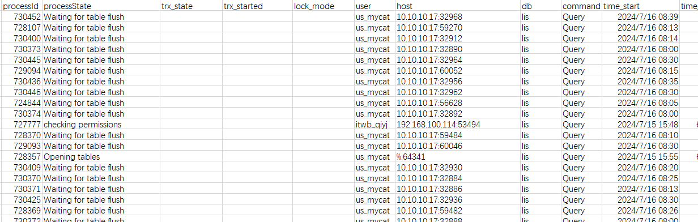

- 场景：[Warning]:MySQL 10.10.20.85 活跃线程数过高，CPU居高不下 导致早6的备份失败。分析下备份异常；

- 分析步骤：

- 查看 MySQL 所有线程确定是哪个PID 占用CPU资源，通过performance_schema的threads 排查是哪个SQL的问题；

- 据观察：

- 有个客户端/* ApplicationName=DBeaver 发起的一个SQL 跑了十几个小时左右，初步判断是长事务导致的一系列问题；

- 在观察process时 发现process state 都是以 `Waiting for table flush` 为主，分析 执行过`flush tables`  但一般业务部门研发没有（reload）权限  所以判断 跟备份有关；

- 


浅说下备份流程，以xtrabackup为主，详情可看`` 本节作为补充；

1. start backup
2. copy ibdata1 / copy .ibd file
3. FLUSH NO_WRITE_TO_BINLOG TABLES  #强制关闭所有正在使用的表且不记录BINLOG
4. Excuted ftwrl #关闭所有被打开的表，并且使用全局锁锁住所有库的所有表、需获取数据库一致状态。如果有事务存在，则该事务提交时会hang住，不会回滚。但不会阻止数据库插入数据 log tables（general_log slow log）
5. backup non-InnoDB tables and files
6. Writing xtrabackup_binlog_info
7. Executed FLUSH NO_WRITE_TO_BINLOG ENGINE LOGS #将innodb层的重做日志持久化到磁盘，然后再进行拷贝，简单来说是让redo log buffer落盘，获取pos点位之后刷redolog
8. Executed UNLOCK TABLES
9. Copying ib_buffer_pool
9. completed OK!

```sql
当数据文件复制完成时，xtrabackup 停止log-copy 线程，并建立一个文件 xtrabackup_checkpoints记录备份的类型，开始时的lsn和结束时的lsn等信息。
而备份生成的 xtrabackup_binlog_info 文件则含义备份完成时对应的binlog的position信息，类似于：mysql-bin.000002        120
 
在备份开始时记录下LSN，然后一个线程复制数据文件，一个线程监控redo log，复制在备份过程中新产生的redo log。虽然我们的到的数据文件显然不是一致性的，但是利用innodb的crash-recovery功能，应用备份过程中产生的redo log文件，就能得到备份完成时那一刻对应的一致性的数据。
 
注意复制数据文件分成了两个过程：
一个是复制innodb事务引擎的数据文件，是不需要持有锁的；另一个是复制非事务引擎的数据文件和table的定义文件.frm，复制这些文件时，是需要先通过FTWRL，然后在进行复制的，所以会导致整个数据库被阻塞。
增量备份时，是通过对表进行全扫描，比较LSN，如果该page的LSN大于上一次别分时的LSN，那么就将该page复制到table_name.ibd.delta文件中。回复时.delta会和redo log应用到全备是的数据文件中。
增量备份在恢复时，除了最后一次增量备份文件之外，其它的增量备份在应用时，只能前滚，不能执行回滚操作，因为没有提交的事务，可能在下一个增量备份中进行了提交，如果你在上一个增量备份时回滚了，那么下一个增量备份应用时，显然就报错了，因为他无法提交事务，该事务以及被回滚了。
```


回到案例本身、通过备份日志查看，xtrabackup 执行了 `flush tables` 出现了锁等待超时，跟某个事务出现了互斥、导致超出系统设置的时间，备份失败退出；

```sql
db1-cao@4821@LM_DEBUG@agent|240716 06:00:33 Executing FLUSH NO_WRITE_TO_BINLOG TABLES...
db1-cao@4821@LM_DEBUG@agent|240716 06:00:33 >> log scanned up to (234756330145)
db1-cao@4821@LM_DEBUG@agent|240716 06:00:34 >> log scanned up to (234756330145)
db1-cao@4821@LM_DEBUG@agent|240716 06:00:35 >> log scanned up to (234756330145)
...
db1-cao@4821@LM_DEBUG@agent|Error: failed to execute query 'FLUSH NO_WRITE_TO_BINLOG TABLES': 1205 (HY000) Lock wait timeout exceeded; try restarting transaction
db1-cao@4821@LM_DEBUG@agent|240716 06:01:33 >> log scanned up to (234756331139)
db1-cao@4821@LM_ERROR@agent|Failed to execute xtrabackup program
db1-cao@4821@LM_ERROR@agent|Failed to make mysql hot backup
```


最终解决方案就是 KILL 长事务,重新备份，研发通过DBeaver发起的一个骚操作。


通过案例本身发现的另一个有意思的：

起初个人研发通过自己用户发起的SQL、通过几次告警抓取到的process 查看 host, 和user列发生了变化；详情如下：

```sql
ServerName	processId	processState	trx_state	trx_started	lock_mode	user	host	db	command	time_start	time_elapsed
**:3306	727777	Sending data	RUNNING	2024/7/15 15:48		itwb_**	**:53494	lis	Query	2024/7/15 15:48	60287
**:3306	727777		RUNNING	2024/7/15 15:48		us_mycat	%:53494	lis	Query	2024/7/15 15:48	60647
```

processid 相同，SQL的起始时间明细对比先前个人用户有所增加，用户名却改变了?

猜测是SQL里面用了某个用户所创建的函数或view导致 user变化；

由于SQL较长排查费时、笔者在测试环境复现 `REVOKE` 掉了所有该用户的权限、再次执行SQL可以给出明显的答案；是该用户加了mysql没有的函数to_char;

over,再会

 
