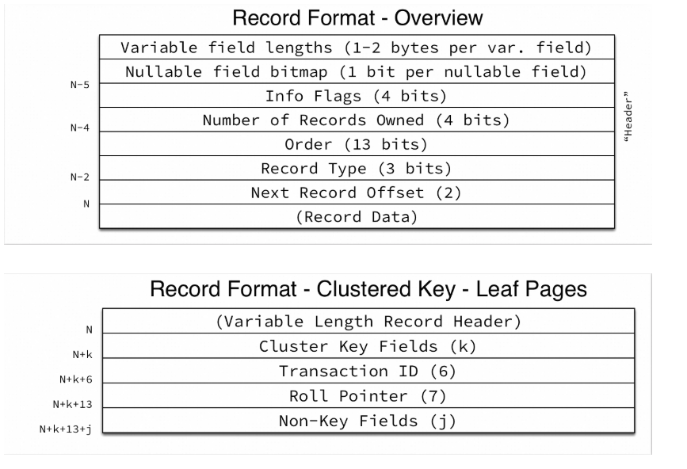

字节

utf8mb4 每个字节字符最多 4字节 *utf8mb4` is a superset of , so for an operation such as the following concatenation, the result has character set and the collation of : `utf8mb3``utf8mb4``utf8mb4_col*

utf8mb3 每个字节字符最多 3字节

<u>偷个图：</u>

```sql
CREATE TABLE `sbtest1` (
  `id` int NOT NULL AUTO_INCREMENT,
  `k` int NOT NULL DEFAULT '0',
  `c` char(120) NOT NULL DEFAULT '',
  `pad` char(60) NOT NULL DEFAULT '',
  PRIMARY KEY (`id`),
  KEY `k_1` (`k`)
) ENGINE=InnoDB AUTO_INCREMENT=10958 DEFAULT CHARSET=latin1
```





Btree高度在某量级下是4层，超出量级最高5层高度；详情可查阅[数据库内核月报](http://mysql.taobao.org/monthly/2024/09/02/) 


**leaf pages：**

大小是16KB，减去页头、尾和目录槽的大小（约200字节），剩下的空间用于存储数据行。

对于sysbench表，每行数据的大小是4（id）+ 4（k）+ 120（c）+ 60（pad）= 188字节。

每行数据的header是5字节，Transaction ID是6字节，Roll Pointer是7字节，所以每行数据的总大小是188 + 5 + 6 + 7 = 206字节。

- 5字节 （字节 ≈  位数/8）

| **字段名称**                | **位数** | **字节数** | **功能**                                                     |
| --------------------------- | -------- | ---------- | ------------------------------------------------------------ |
| **Info Flags (信息标志)**   | 4 位     | 0.5 字节   | 存储一些标志位，用于记录行记录的元信息，例如记录是否被标记为删除（Delete Flag）等。 |
| **Number of Records Owned** | 4 位     | 0.5 字节   | 表示当前记录“拥有的子记录”数量（记录之间有段结构），在维护页内部链表时使用。 |
| **Order (记录顺序)**        | 13 位    | 1.625 字节 | 表示记录的顺序，用于管理页面内行记录的排列位置。             |
| **Record Type (记录类型)**  | 3 位     | 0.375 字节 | 表示记录的类型，常见类型有：普通记录、最小记录（min record）和最大记录（max record）等。 |
| **Next Record Offset**      | 16 位    | 2 字节     | 表示下一条记录的偏移量，用于形成链表结构。                   |

因此，每个叶节点可以存储的行数是 (16 * 1024 - 200) / 206 ≈ 78.5行。


**non-leaf pages：**

大小也是16KB，减去页头、尾和目录槽的大小（约200字节），剩下的空间用于存储索引的键值和指向子节点的指针。

对于sysbench表，如果主键是INT类型，每个键值是4字节，每个指针是4字节，所以每个非叶节点可以存储的行数是 (16 * 1024 - 200) / (5 + 4 + 4) ≈ 1233行。


**Btree高度**：（限制为单表64T）

- 高度为1时，只有1个叶节点，可以存储79行数据，大小为16KB。
- 高度为2时，有1个非叶节点和1233个叶节点，可以存储1233 * 79 = 97407行数据，大小为16KB（非叶节点）+ 1233 * 16KB（叶节点）= 19MB。
- 高度为3时，有1234个非叶节点和1520289个叶节点，可以存储1520289 * 79 = 120102831行数据，大小为1234 * 16KB（非叶节点）+ 1520289 * 16KB（叶节点）= 23GB。
- 高度为4时，有1521523个非叶节点和1874516337个叶节点，可以存储1874516337 * 79 = 148086790623行数据，大小为1521523 * 16KB（非叶节点）+ 1874516337 * 16KB（叶节点）= 27.9TB。


**page：**

1. **Page Header**：大约50字节，用于存储页的元数据，如页的状态、类型、LSN（Log Sequence Number）等。
2. **Page Footer**：大约50字节，用于存储页的校验和、页的类型等信息。
3. **Directory Slots**：大约100字节，用于存储指向页中行记录的指针数组。每个槽通常占用2字节，但这个值可能会根据页中行记录的数量而变化。


计算索引长度：
innodb索引长度计算公式：Character Set：utf8mb4=4,utf8=3,gbk=2,latin1=1) * 列长度 + 1(允许 Null) + 2(变长列)
