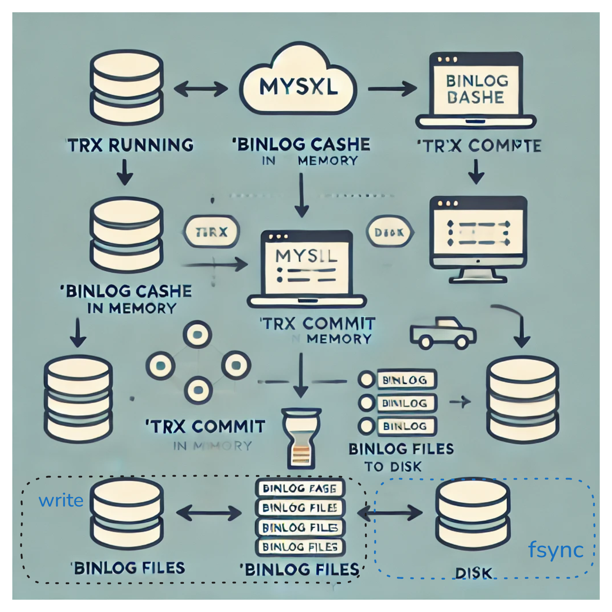
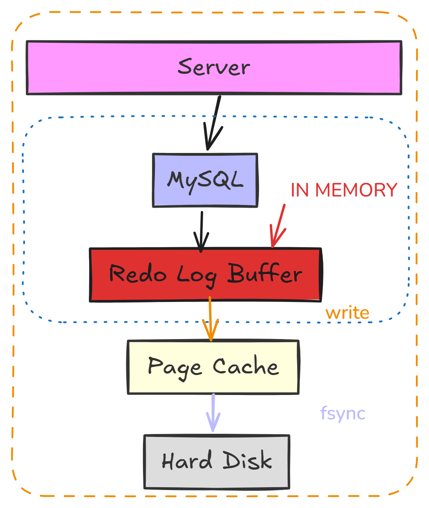

binlog 与 redolog

binlog写入机制：事务执行过程中，先把日志写到 binlog cache，提交时把binlog cache写到binlog中；注意事务是一次性写入

binlog cache 会分配一块内存，并且分给每个线程固定 由`binlog_cache_size`控制、如果binlog超出了size大小 会占用磁盘临时空间、事务提交或者回滚后会被删除 binlog cache清空；总的大小由`max_binlog_cache_size`限制；

write，是指把日志写入到文件系统的 page cache，并没有把数据持久化到磁盘，所以速度比较快。

fsync，是将数据持久化到磁盘的操作。一般情况下， fsync 才会占磁盘的 IOPS。

sync_binlog 
sync_binlog 只有等于1是才会 fsync 、所以该值为1时是最安全 且性能最低的，一般情况我们会认为 fsync 操作才会占用iops
改值为0 时, 每次提交事务后 只write 不fsync 依赖操作系统刷盘 性能最佳
sync_binlog=N(N>1 每次事务都会write 累计N 个事务才fsync 风险是：如主机异常重启，会丢失最近 N 个事务的 binlog 日志

redolog写入机制：当事务执行时，相关的修改操作会首先记录到内存中的 *redo log buffer*。

有个问题 

1. redo log buffer 里面的内容，是不是每次生成后都要直接持久化到磁盘？*不需要.*
2. 事务还没提交的时候，redo log buffer 中的部分日志有没有可能被持久化到磁盘？*有可能*.

innodb_flush_log_at_trx_commit 参数 控制redolog写入策略

0 每次事务提交时 innodb 每秒将log buffer中的数据更新到磁盘，不主动触发刷盘
1 每次事务提交时都将 redo log 直接持久化到磁盘
2 每次事务提交时都只是把 redo log 写到 page cache
事务执行中间过程的 redo log 也是直接写在 redo log buffer 中的，这些 redo log 也会被后台线程一起持久化到磁盘。也就是说，一个没有提交的事务的 redo log，也是可能已经持久化到磁盘的。
除了后台线程每秒一次的轮询操作外，还有两种场景会让一个没有提交的事务的 redo log 写入到磁盘中。

一种是，redo log buffer 占用的空间即将达到 innodb_log_buffer_size 一半的时候，后台线程会主动写盘。
 注意，由于这个事务并没有提交，所以这个写盘动作只是 write，而没有调用 fsync，也就是只留在了文件系统的 page cache。
另一种是，并行的事务提交的时候，顺带将这个事务的 redo log buffer 持久化到磁盘。

崩溃恢复逻辑是要依赖于 prepare 的 redo log，再加上 binlog 来恢复；每秒一次后台轮询刷盘，再加上崩溃恢复这个逻辑，InnoDB 就认为 redo log 在 commit 的时候就不需要 fsync 了，只会 write 到文件系统的 page cache 中就可以。

log sequence number，LSN； LSN 是单调递增的，用来对应 redo log 的每一个写入点；每次写入长度为 length 的 redo log， LSN 的值就会加上 length。LSN 也会写到 InnoDB 的数据页中，来确保数据页不会被多次执行重复的 redo log

一次组提交里面，组员越多，节约磁盘 IOPS 的效果越好。所以一般不繁忙业务 MTS并发线程并无提升；在并发更新场景下，第一个事务写完 redo log buffer 以后，接下来这个 fsync 越晚调用，组员可能越多，节约 IOPS 的效果就越好。

提升 binlog 组提交的效果，可以通过设置 binlog_group_commit_sync_delay 和 binlog_group_commit_sync_no_delay_count 来实现。

1. binlog_group_commit_sync_delay 参数，表示延迟多少微秒后才调用 fsync;
2. binlog_group_commit_sync_no_delay_count 参数，表示累积多少次以后才调用 fsync。

这两个条件是或的关系，也就是说只要有一个满足条件就会调用 fsync。

binlog_group_commit_sync_delay 设置为 0 的时候，binlog_group_commit_sync_no_delay_count 就无效了。

小贴士 浅谈binlog format

MySQL BINLOG 日志 三种格式 statement、row以及mixed

statement 格式是MySQL老版本默许的、有缺陷，现有企业级大多数是row；

缺陷就是 statement格式 会在binlog保留原始SQL、如果原始SQL涉及到多个索引值，又恰好主备的索引不一 会导致SQL执行计划有偏差 导致错误的结果集从而影响主备数据不一致的情况；

row格式 除了binlog文件会真磁盘 目前并无缺陷，row格式 从statement的原始SQL替换成了EVENT、即table_map_event EVENT 映射了表的元数据（表名，列结构等）为行级事件提供了上文信息 write delete event等。

因为参数`binlog_row_image` 默认配置为 FULL ，所以 delete event包含了行的所有信息；

mixed 是中和上述两选项的选择，会自动判断SQL语句是否会引起主备不一的情况进行抉择。
