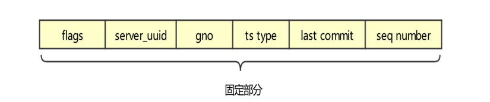
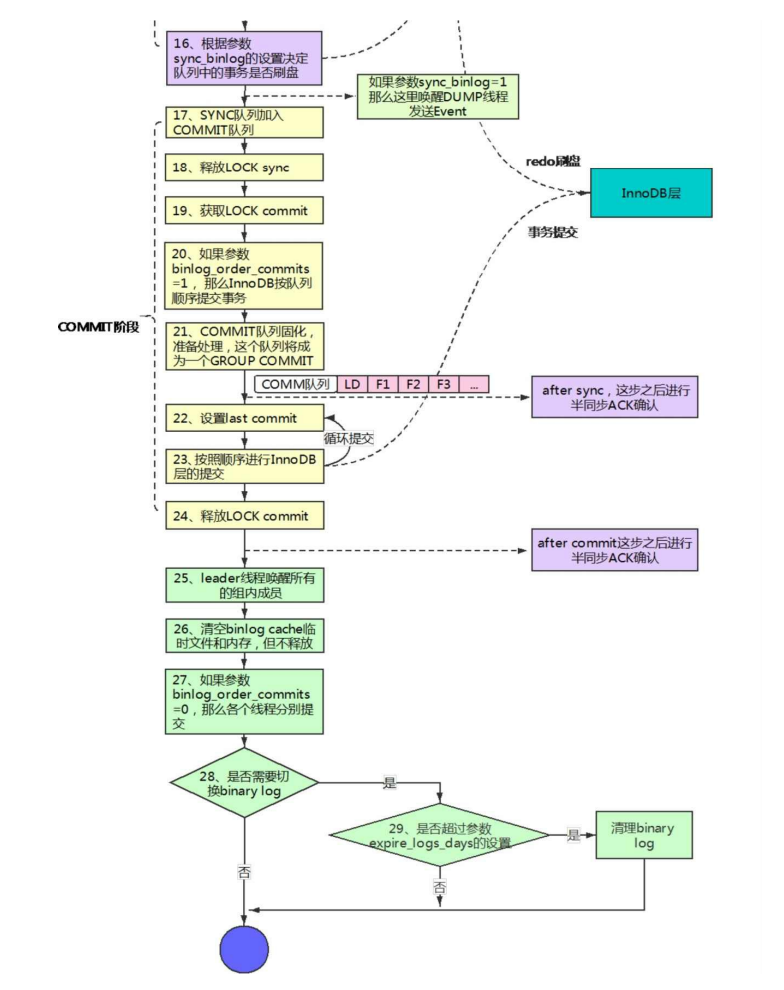
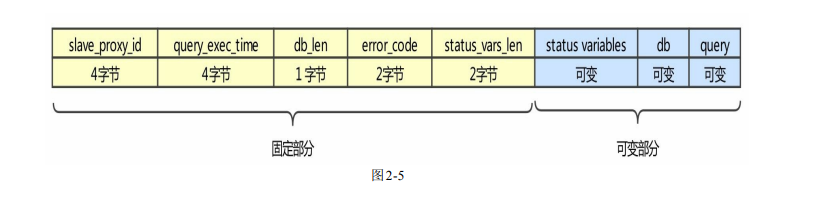
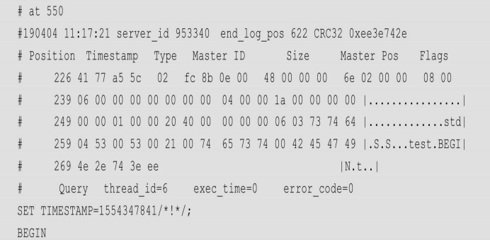
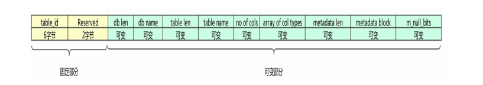

#### Event之GTID_EVENT；

GTID_EVENT和ANONYMOUS_GTID_EVENT格式一致，只是携 带的数据不一样而已，只解释GTID_EVENT即可。

##### GTID_EVENT的作用：

GTID 的作用我们前面已经说过了，后面还会提及。这里我们只需要知道 GTID_LOG_EVENT主要记录下面三部分内容。

1. GTID的详细信息。
2. 逻辑时钟详细信息，即last commit和seq number。
3. 是否是行模式的，比如DDL语句就不是行模式的。

需要注意，在显示开启事务的情况下，GTID_EVENT 和 XID_EVENT Event header 的timestamp都是commit命令发起的时间，当然，如果没有显示开启事务，那么timestamp还 是命令发起的时间。


##### 源码重要接口

1. 主库

   初始化构造函数：Gtid_log_event：：Gtid_log_event（THD* thd_arg，bool using_trans，int64 last_committed_arg，int64 sequence_number_arg，bool may_have_sbr_stmts_arg）；

   GTID_EVENT不需要写入binlog cache：从内存直接写入binary log，作为事务的第一 个Event。但是其中包含一个写入内存的函数叫作write_to_memory，其中的 write_data_header_to_memory函数描述了写入的格式；

2. 从库

   读取构造函数：Gtid_log_event：：Gtid_log_event（const char *buffer，uint event_len，const Format_description_event *description_event）；

   应用函数：Gtid_log_event：：do_apply_event.


##### 主体格式

GTID_EVENT的Event data只有固定部分，没有可变部分。



其中，flags：1字节，主要用于表示是否是行模式的，如果是则为0X00，否则为0X01。 注意DDL都不是行模式的，而是语句模式的。 

server_uuid：16字节，server_uuid变量去掉中间“-”的十六进制表示。 

gno：8字节，小端显示。表示GTID的序号。 

ts type：1字节，固定为02。

last commit：8字节，小端显示。 

seq number：8字节，小端显示。 关于last commit和seq number 先贴个图 有机会 会补充详细步骤：



​																																																	图e


##### 简单解析（GTID_EVENT（mysqlbinlog--hexdump 输出））

```sql
# at 755
#231121 14:27:18 server id 593308  end_log_pos 834 CRC32 0x0266515d
# Position  Timestamp   Type   Source ID        Size      Source Pos    Flags
# 000002f3 c6 4d 5c 65   21   9c 0d 09 00   4f 00 00 00   42 03 00 00   00 00
# 00000306 01 8f 78 a6 59 37 44 11  ee 8a 40 00 0c 29 16 b2 |..x.Y7D.........|
# 00000316 36 89 c1 19 00 00 00 00  00 02 01 00 00 00 00 00 |6...............|
# 00000326 00 00 02 00 00 00 00 00  00 00 22 c1 c1 b1 a3 0a |................|
# 00000336 06 fc 34 01 a2 38 01 00  5d 51 66 02             |..4..8...Qf.|
#       GTID    last_committed=1        sequence_number=2       rbr_only=no     original_committed_timestamp=1700548038476066   immediate_commit_timestamp=1700548038476066     transaction_length=308
# original_commit_timestamp=1700548038476066 (2023-11-21 14:27:18.476066 CST)
# immediate_commit_timestamp=1700548038476066 (2023-11-21 14:27:18.476066 CST)
/*!80001 SET @@session.original_commit_timestamp=1700548038476066*//*!*/;
/*!80014 SET @@session.original_server_version=80034*//*!*/;
/*!80014 SET @@session.immediate_server_version=80034*//*!*/;
SET @@SESSION.GTID_NEXT= '8f78a659-3744-11ee-8a40-000c2916b236:1687945'/*!*/;
# at 834
```

其中，00：说明这是行模式的事务。实际上解析出来也有，即rbr_only=yes。 8f 78 a6 59 37 44 11  ee 8a 40 00 0c 29 16 b2 36：是server_id，如下

```sql
+---------------+--------------------------------------+
| Variable_name | Value                                |
+---------------+--------------------------------------+
| server_uuid   | 8f78a659-3744-11ee-8a40-000c2916b236 |
+---------------+--------------------------------------+
```

89 c1 19 00 00 00 00  00：GTID的序号，小端显示，十进制值为1687945

02：ts type。

01 00 00 00 00 00  00 00：即last_committed=1，小端显示，为0X01。

02 00 00 00 00 00  00 00：即sequence_number=2，小端显示，为0X02。


##### 生成时机

GTID_EVENT生成和写入binary log都在order commit的FLUSH阶段，(见上文图e)


ANONYMOUS_GTID_EVENT

这是匿名GTID Event，在MySQL 5.7中，如果不开启GTID则使用这种格式。它除了不 生成GTID相关信息，其他和GTID_EVENT保持一致，即server_uuid和gno为0。因此就不单 独解析了，有兴趣的读者可以自行解析一下，比较简单。


##### GTID的三种模式

1. 自动生成GTID：主库一般是这种情况，源码叫作AUTOMATIC_GROUP。
2. 指定GTID：从库或者使用GTID_NEXT一般是这种情况，源码叫作 GTID_GROUP。
3. 匿名GTID：不开启GTID的时候生成，源码叫作ANONYMOUS_GROUP。 下面是源码及注释，供参考。

```sql
enum enum_gtid_type {
  /**
    Specifies that the GTID has not been generated yet; it will be
    generated on commit.  It will depend on the GTID_MODE: if
    GTID_MODE<=OFF_PERMISSIVE, then the transaction will be anonymous;
    if GTID_MODE>=ON_PERMISSIVE, then the transaction will be assigned
    a new GTID.

    This is the default value: thd->variables.gtid_next has this state
    when GTID_NEXT="AUTOMATIC".

    It is important that AUTOMATIC_GTID==0 so that the default value
    for thd->variables->gtid_next.type is AUTOMATIC_GTID.
  */
  AUTOMATIC_GTID = 0,
  /**
    Specifies that the transaction has been assigned a GTID (UUID:NUMBER).

    thd->variables.gtid_next has this state when GTID_NEXT="UUID:NUMBER".

    This is the state of GTID-transactions replicated to the slave.
  */
  ASSIGNED_GTID,
  /**
    Specifies that the transaction is anonymous, i.e., it does not
    have a GTID and will never be assigned one.

    thd->variables.gtid_next has this state when GTID_NEXT="ANONYMOUS".

    This is the state of any transaction generated on a pre-GTID
    server, or on a server with GTID_MODE==OFF.
  */..
```


##### 重点Event之QUERY_EVENT和MAP_EVENT

###### QUERY_EVENT

###### QUERY_EVENT的作用：

QUERY_EVENT不仅会记录一些语句的运行环境，比如SQL_MODE、客户端字符集、 自增环境设置、当前登录数据库等，而且会记录执行时间。但对于行模式的 DDL 和 DML 记录的执行时间会有所不同，需要额外注意，如下。

DML：执行时间记录的是第一条数据更改后的时间，而不是DML语句执行的时间（一 个DML语句可能修改很多条数据）。这个时间往往非常短，不能正确地表示DML语句执行 的时间。语句部分记录的是begin。

DDL：执行时间记录的是实际语句的执行时间，语句部分记录的是实际的语句。

执行时间是 Seconds_Behind_Master 计算的一个影响因素，4.9 节将会详细介绍 Seconds_Behind_Master的计算公式。一个事务只有一个QUERY_EVENT。

###### 源码重要接口

主库：

初始化构造函数：Query_log_event：：Query_log_event（THD* ，char const* ， size_t，bool，bool，bool，int，bool）；

写入binlog cache：Query_log_event：：write（IO_CACHE* file）。 从库

从库：

读取构造函数：Query_log_event：：Query_log_event（char const*，uint， binary_log：：Format_description_event const* ，binary_log：：Log_event_type）；

应用函数：Query_log_event：：do_apply_event.

###### 主体格式

QUERY_EVENT包含固定和可变两部分，如图



其中，固定部分如下。

slave_proxy_id：4字节，主库生成Event的thread id，它和show processlist中的id对应。 

query_exec_time：4字节，这是执行时间。但是对于行模式的 DML 语句，这个执行时 间并不准确，上面已经描述了原因。而对于DDL，它还是比较准确的。 

db_len：1字节，用于描述数据库名的长度。 

error_code：2字节，执行语句的错误码。 

status_vars_len：2字节，status variables部分的长度。 可变部分如下。 

status variables：环境参数，其中包含很多种格式。每种格式都有自己的长度和数据 域，因此可以轻松地读取到各种值。比如SQL_MODE、客户端字符集、自增环境、客户端 排序字符集等，但是其过于复杂，这里不做解析。 

db：当前登录的database名字，以0x00结尾。主库来源为源码变量thd->db。如果是语句 模式，则从库做过滤的时候会使用这个名字。 

query：具体的语句。对于行模式的DML，记录的是begin，而对于DDL，记录的是具体 的语句。

```sql
thd->set_time(&(common_header->when));
/*这段代码会设置线程的命令执行时间为Event header中Timestamp的时间，因此，我们在
从库上执行now（）函数时，是可以得到正确的结果的*/
```


###### 实例解析  

行模式的DML的QUERY_EVENT（mysqlbinlog--hexdump输出）：




其中，固定部分如下。 

06 00 00 00：thread id为6。 

00 00 00 00：执行时间，对于行模式的DML来讲通常不准。 

04：当前登录数据库名的长度。 

00 00：错误码。 

1a 00：status variables部分的长度，十六进制值1a就是十进制值26。 可变部分如下。 

status variables：略。 

74 65 73 74 00：当前登录库名test的ASCII编码，以0x00结尾。 

42 45 47 49 4e：语句BEGIN的ASCII编码。 

中间有一部分是status variables，这部分过于复杂，所以没有做实际解析。 


###### 生成时机

对于行模式的DML而言，生成时机是在事务的第一个DML语句的第一行数据修改之 后。通常来讲，一个事务对应一个QUERY_EVENT。 DDL的生成时机在整个操作执行完成之后。

DDL的生成时机在整个操作执行完成之后。

​	

#### MAP_EVENT

###### MAP_EVENT的作用

MAP_EVENT是行模式特有的，它的主要作用是映射table id和实际访问表。其中还包含 了一些表的定义，如表所在库名、表名、字段类型、可变字段长度等。这里的库名和 QUERY_EVENT的库名不一样，这个库名来自表的定义，

QUERY_EVENT的库名来自当 前登录的数据库，即源码变量thd->db。


###### 源码重要接口

主库

初始化构造函数：Table_map_log_event：：Table_map_log_event（THD *thd_arg， TABLE *tbl，const Table_id& tid，bool is_transactional）；

写入binlog cache：Table_map_log_event：：write_data_header， Table_map_log_event：：write_data_body。

从库

读取构造函数：Table_map_log_event（const char *buf，uint event_len，const Format_description_event *description_event）；

应用函数：Table_map_log_event：：do_apply_event。


###### 主体格式

MAP_EVENT的主体格式如图




其中，固定部分如下。

table_id：6字节，这个table_id和InnoDB层的table_id不一样，它分配的时机是第一次打 开表定义时。它不是固定的，重启MySQL实例或者执行flush table命令都会导致其改变。下 面是table_id更改的代码：

```sql
1.在函数 get_table_share中包含代码：
 assign_new_table_id（share）
2.在函数 assign_new_table_id中包含代码：
  share->table_map_id= last_table_id++;
```

Reserved：2字节，保留以后使用

可变部分如下。

db len：表所在数据库名的长度。

db name：实际数据库名，以0x00结尾。

table len：表名的长度。

table name：实际表名，以0x00结尾。

no of cols：表中字段数量。

array of col types：字段的类型数组。

metadata len：metadata block的长度。

metadata block：对于可变字段需要记录字段的长度，但对于int这种数据类型就不需要 了，因为它的长度是固定的。下面代码是varchar关于可变长度的输出，它占用2字节。

```sql
int Field_varstring::do_save_field_metadata(uchar *metadata_ptr) const {
  assert(field_length <= 65535);
  int2store((char *)metadata_ptr, field_length);
  return 2;
}
```

如果感兴趣可以查看do_save_field_metadata函数。

m_null_bits：一个位图，用于表示字段是否可以为空。下面是位图的获取方式。(8034)

```sql
 // if the column is not marked as 'null', print 'not null'
    if (!(m_null_bits[(i / 8)] & (1 << (i % 8))))
      my_b_printf(file, " NOT NULL");
    else if (i == 0 && has_generated_invisible_primary_key()) {
      my_b_printf(file, " NOT NULL");
    }
```


###### 实例解析

插入一条数据

```sql
lixl@msql[(none)]> INSERT INTO e.t (product_name, product_code, is_valid, channel, appntexemption_flag, main_risks_flag, additional_main_risks_flag, additional_risks_flag, create_time, parent_id)
    -> VALUES ('test', '00039', '1', '3', '张三', 'N', 'Y', 'N', '2018-08-02 14:03:37', 101400);
Query OK, 1 row affected (0.09 sec)
```

这个INSERT语句的MAP_EVENT如下：

```sql
# at 2554
#231122 13:24:28 server id 593308  end_log_pos 2631 CRC32 0x655674de
# Position  Timestamp   Type   Source ID        Size      Source Pos    Flags
# 000009fa 8c 90 5d 65   13   9c 0d 09 00   4d 00 00 00   47 0a 00 00   00 00
# 00000a0d 63 0c 00 00 00 00 01 00  01 65 00 01 74 00 0b 08 |c........e..t...|
# 00000a1d 0f 0f fe 0f 0f fe fe fe  12 08 11 00 02 00 01 fe |................|
# 00000a2d 04 28 00 28 00 fe 04 fe  04 fe 04 00 fe 07 01 01 |................|
# 00000a3d 00 02 03 fc ff 00 de 74  56 65                   |.......tVe|
#       Table_map: `e`.`t` mapped to number 3171
# has_generated_invisible_primary_key=0
```

其中，63 0c 00 00 00 00 ：表示table_id，即十六进制值0c63, 转换十进制值是3171

01 00：保留。

01：表所在的数据库名长度为01

65 00 01：数据库名ep的ASCII表示，以0x01结尾

74：表名的长度为74

00 0b 08：表名ty的ASCII表示，以0x08结尾

书中74页、可能是版本不一致笔者测试与书中有出入、需深究追溯。


###### 生成时机

本 Event 只会在行模式下生成。生成时机是事务的每条 DML 语句修改的第一行数据在 InnoDB 引擎层修改完成，并且在QUERY_EVENT生成之后。通常来讲，每个语句的每个表 都会包含这样一个MAP_EVENT。


###### table_id的易变性

```sql
# at 3277
...                 
#       Write_rows: table id 3171 flags: STMT_END_F

# at 4078
...
#       Write_rows: table id 3208 flags: STMT_END_F
```

这是一个事务，其中，相同表的table_id却不一样，可以观察到如下现象。

at 3277： Table_map: `e`.`t` mapped to number 3171

at 4078： Table_map: `e`.`t` mapped to number 3208

我们发现，这里同样的t表对应了两个不同的table_id，证明table_id是可变的。


Event之WRITE_EVENT和DELETE_EVENT见后文