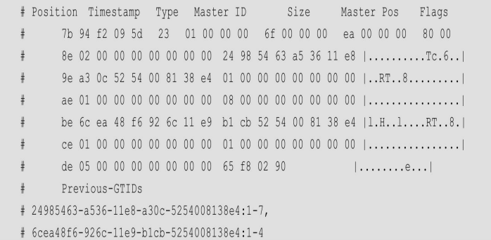

接 尾末Event格式,
在主从间，Event起到了数据载体的作用，它们在主从之间传递， 可以说是一组协议。这里将用一定的篇幅来解释常用的Event。针对每一个Event会给出一些 函数接口，为想调试的用户提供函数入口。

binary log综述：

每个binary log都是由开头4字节的魔术数和一个一个Event组成的，

可以在Linux系统中使用hexdump-Cv查看魔术 数，如下：

```sql
[root@localhost binlog]# hexdump -Cv mysql-bin.000066
00000000  fe 62 69 6e 3a 49 5c 65  0f 9c 0d 09 00 7a 00 00  |.bin:I\e.....z..|
... /*这里fe 62 69 6e的十六进制编码就是binary log的魔术数*/
```

在使用mysqlbinlog 进行binary log解析的时候总是从# at 4开始的。这个魔术数在源码中定义如下：

```sql
/* 4 bytes which all binlogs should begin with */
#define BINLOG MAGIC"\xfelx62\x69\x6e"
```


Event header和Event footer

这两部分在每个Event中都是一样的，大小和格式都是固定的。下面解释它们的含义。

1.**Event header** 

**timestamp：**固定4字节，是从新纪元时间（1970年1月1日0时0分0秒）以来的秒数。这 个时间是命令发起的时间。如何定义命令发起呢？它是语句开始执行的时间，源码可以是在 dispatch_command函数的开头设置的（thd->set_time（））。言外之意就是语法意义、权限 检查、优化器生成执行计划的时间都包括在里面。还要注意这个时间在从库计算 Seconds_Behind_Master的时候是一个重要的依据，这一点我们将在4.9节详细介绍。 

**type code：**固定1字节，是Event的编码。每个Event都有自己的编码。 

**server_id：**固定4字节，就是生成这个Event数据库的server_id。即便从库端开启了参数 log_slave_updates，从库将主库的Event写到自己的binary log中，这个server_id也依然是主库 的server_id，源码有如下设置：

```sql
thd->server id =ev->server id;//server id 将会继承到从库
// use the original server id for logging
```

如果这个Event再次传到主库，那么需要跳过，不会写入 relay log。源码可以在 Log_event：：do_shall_skip（由queue_event函数调入）函数中找到跳过逻辑，如下：

```sql
if ((server id == ::server id && !rli->replicate same server id)||
    //server id == ::server id 代表本地server id和Event的server id
    //如果相同，则忽略。但是受到参数 replicate same server id的影响
    	(rli->slave skip counter == 1 && rli->is in group()))
    	return EVENT SKIP IGNORE;
```

**event_len：**固定4字节，是整个Event的长度。 

**end_log_p：**固定4字节，是下一个Event的开始位置。 

**flags：**固定2字节，某些Event包含这个标识，比如Format_description_log_event中的 LOG_EVENT_BINLOG_IN_USE_F标识说明本binary log是当前正在写入的。 

2.**Event footer** 

**crc：**固定4字节，这部分就是整个Event的crc校验码，用于标识Event的完整性。 

如果要查看它们的完整定义可以参考源码的Log_event_header类和Log_event_footer类。 实际上在源码中还将Event data部分更细致地分为header和body部分，对应了固定部分和可变 部分，后面我们会看到。


具体解析:

使用 mysqlbinlog-hexdump 来解析这两个固定的部分，

```sql
[root@localhost binlog]# /data/mysql_basedir_8034/bin/mysqlbinlog --hexdump ./mysql-bin.000066
...
# at 4
#231121 14:07:54 server id 593308  end_log_pos 126 CRC32 0xcde035a1
# Position  Timestamp   Type   Source ID        Size      Source Pos    Flags
# 00000004 3a 49 5c 65   0f   9c 0d 09 00   7a 00 00 00   7e 00 00 00   01 00
# 00000017 04 00 38 2e 30 2e 33 34  00 00 00 00 00 00 00 00 |..8.0.34........|
# 00000027 00 00 00 00 00 00 00 00  00 00 00 00 00 00 00 00 |................|
# 00000037 00 00 00 00 00 00 00 00  00 00 00 00 00 00 00 00 |................|
# 00000047 00 00 00 00 00 00 00 00  13 00 0d 00 08 00 00 00 |................|
# 00000057 00 04 00 04 00 00 00 62  00 04 1a 08 00 00 00 08 |.......b........|
# 00000067 08 08 02 00 00 00 0a 0a  0a 2a 2a 00 12 34 00 0a |.............4..|
# 00000077 28 00 01 a1 35 e0 cd                             |....5..|
#       Start: binlog v 4, server v 8.0.34 created 231121 14:07:54
# Warning: this binlog is either in use or was not closed properly.
BINLOG '
OklcZQ+cDQkAegAAAH4AAAABAAQAOC4wLjM0AAAAAAAAAAAAAAAAAAAAAAAAAAAAAAAAAAAAAAAA
AAAAAAAAAAAAAAAAAAAAAAAAEwANAAgAAAAABAAEAAAAYgAEGggAAAAICAgCAAAACgoKKioAEjQA
CigAAaE14M0=
'/*!*/;
# at 126
```

**timestamp** ：3a 49 5c 65  实际是十六进制 655c493a。 转换 十进制 就是为1700546874，可以用Linux date -d 换算：

```sql
[root@localhost ~]# date -d @1700546874
2023年 11月 21日 星期二 14:07:54 CST
```

这个时间刚好就是mysqlbinlog解析出来的231121 14:07:54；

**type code：**0f是十六进制值。将其转换为十进制值是15。这就是每个Event独有的type code。

**server_id：** 9c 0d 09 00小端显示，实际上就是十六进制的00090d9c 将其转换为十进制值 就是593308，这就是server_id。

**event_len：**7a 00 00 00小端显示，十六进制值是0000007a，将其转换十进制值是122，这 是本Event的长度。打印出来的at 4 到 at 126 刚好是122字节。

**end_log_p：**7e 00 00 00小端显示，十六进制值是0000007e，将其转换为十进制值是126。这就是下一个Event开始的地址。我们能够在mysqlbinlog解析中看到这个位置：#at 126

**flags：**01 00


session涉及的Event类型

只介绍下列常用的Event：

QUERY_EVENT= 2：在语句模式下记录实际的语句。在行模式下DML不记录任何语句相关的信息，DDL是记录的语句。本书只考虑行模式。

FORMAT_DESCRIPTION_EVENT= 15：说明binary log的版本信息。总是在每一个 binary log的开头。 

XID_EVENT= 16：当事务提交的时候记录这个Event，其中携带了XID信息。 

TABLE_MAP_EVENT = 19：包含table_id和具体表名的映射关系。 

WRITE_EVENT = 30：INSERT语句生成的Event，包含插入的实际数据，是行模式才有 的。 

UPDATE_EVENT = 31：UPDATE语句生成的Event，包含数据的前后映像数据，是行模 式才有的。 

DELETE_EVENT = 32：DELETE语句生成的Event，包含实际需要删除的数据，是行模 式才有的。 

GTID_EVENT= 33：在开启GTID的时候生成关于GTID的信息，并且携带了last commit 和seq number信息。 

ANONYMOUS_GTID_LOG_EVENT= 34：在关闭GTID的时候生成，并且携带了last commit和seq number信息。 

PREVIOUS_GTIDS_EVENT= 35：前面所有的binary log包含的GTID SET，relay log代 表I/O线程收到的GTID SET。 

接下来，我们按照一个事务生成Event的顺序进行详细讲解，要了解完整的Event type code可以参考源码中的Log_event_type枚举类型。

最后重申一下Event的重要性，Event是主从同步的基础，了解常用的Event是学习主从原 理不可或缺的部分。


重点Event之 FORMAT_DESCRIPTION_EVENT和 PREVIOUS_GTIDS_LOG_EVENT：

FORMAT_DESCRIPTION_EVENT

**1.FORMAT_DESCRIPTION_EVENT**的作用

FORMAT_DESCRIPTION_EVENT是binary log的第一个Event。这个Event比较简单，因 为它携带的数据都是固定的，没有可变部分。其中包含binary log的版本信息、MySQL的版 本信息、Event_header的长度，以及每个Event type的固定部分的长度。

下列信息将会保存在从库的内存中：

1. 在从库的内存中保存主库的信息，源码变量是Master_info.mi_description_event。

2. 将从库的relay log的FORMAT_DESCRIPTION_EVENT Event记录为和主库相同的 值，它存储在源码变量Relay_log_info.rli_description_event中。 Format_description_log_event：：do _apply_event函数中，包含如下片段：

   ```sql
   /* Save the information describing this binlog */
   copy_crypto_data(*rli->get rli description event());
   const cast<Relay log info *>(rli)->set rli description event(this);
   ```

至少在以下场景下会读取其中的信息：

1. 每次SQL线程应用Event的时候都会获取其Event_header的长度和相应Event固定部 分的长度。
2. 在I/O线程启动的时候检测版本，参考get_master_version_and_clock函数。
3. 将信息写入relay log开头的FORMAT_DESCRIPTION_EVENT。

它一定出现在binary log开头，位置固定为#4

**2.**源码重要接口

主库

- 初始化构造函数：Format_description_log_event：： Format_description_log_event（uint8_t binlog_ver，const char* server_ver=0）；
- 写入binlog cache：Format_description_log_event：：write（IO_CACHE* file）。

从库

- 读取构造函数：Format_description_log_event：：Format_description_log_event（const char* buf，uint event_len，const Format_description_event *description_event）；
- 应用函数：Format_description_log_event：：do_apply_event。

**3.**主体格式

FORMAT_DESCRIPTION_EVENT没有可变部分，如图所示。


其中，固定部分如下。

**binlog_version：**2字节，binary log的版本为4。

**server_version：**50字节，MySQL的版本为字符串形式。 

**create_timestamp：**4 字节，在 MySQL 每次启动时，第一个 binary log 的 FORMAT_DESCRIPTION_EVENT都会记录其启动时间，在其他情况下为0。源码中有如下 解释，供参考。

```sql
	If this event is at the start of the first binary log since server startup 'created'
should be the timestamp when the event (and the binary log) was created, In the other
case (i.e. this event is at the start of a binary log created by FLUSH LOGS or automaticrotation),
'created' should be 0. This "trick" is used by MySQL >=4.0.14 slaves to knoww
hether they must drop stale temporary tables and whether they should abort unfinishedtransaction.
```

**header_length：**1字节，Event header的长度当前为19。 

**array of post-header：**当前MySQL版本为39字节。这是一个数组，用于说明每个Event 类型的固定部分有多大。

**4.**实例解析

下面是一个FORMAT_DESCRIPTION_EVENT（mysqlbinlog--hexdump 输出）：

```sql
# at 4
#231121 14:07:54 server id 593308  end_log_pos 126 CRC32 0xcde035a1
# Position  Timestamp   Type   Source ID        Size      Source Pos    Flags
# 00000004 3a 49 5c 65   0f   9c 0d 09 00   7a 00 00 00   7e 00 00 00   01 00
# 00000017 04 00 38 2e 30 2e 33 34  00 00 00 00 00 00 00 00 |..8.0.34........|
# 00000027 00 00 00 00 00 00 00 00  00 00 00 00 00 00 00 00 |................|
# 00000037 00 00 00 00 00 00 00 00  00 00 00 00 00 00 00 00 |................|
# 00000047 00 00 00 00 00 00 00 00  13 00 0d 00 08 00 00 00 |................|
# 00000057 00 04 00 04 00 00 00 62  00 04 1a 08 00 00 00 08 |.......b........|
# 00000067 08 08 02 00 00 00 0a 0a  0a 2a 2a 00 12 34 00 0a |.............4..|
# 00000077 28 00 01 a1 35 e0 cd                             |....5..|
#       Start: binlog v 4, server v 8.0.34 created 231121 14:07:54
# Warning: this binlog is either in use or was not closed properly.
BINLOG '
OklcZQ+cDQkAegAAAH4AAAABAAQAOC4wLjM0AAAAAAAAAAAAAAAAAAAAAAAAAAAAAAAAAAAAAAAA
AAAAAAAAAAAAAAAAAAAAAAAAEwANAAgAAAAABAAEAAAAYgAEGggAAAAICAgCAAAACgoKKioAEjQA
CigAAaE14M0=
'/*!*/;
# at 126
```

从第五行开始解析如下。 

**04 00**：binary log的版本为4。

**38 2e ～00 00：**当前MySQL的版本是8.0.34

**3a 49 5c 65**：小端显示 上文已解释不再做赘述。

**5.**生成时机

FORMAT_DESCRIPTION_EVENT作为binary log的第一个Event，一般都是在binary log 切换的时候发生的。例如，flush binary logs命令；binary log自动切换；重启MySQL实例。

注意，在本Event的Event header中，flags如果为 LOG_EVENT_BINLOG_IN_USE_F，则 说明当前binary log没有关闭（比如本binary log为当前写入文件或者异常关闭MySQL实 例）。如果异常关闭MySQL实例，那么会检测这个值以决定是否做binary log recovery。


PREVIOUS_GTIDS_LOG_EVENT

**1.PREVIOUS_GTIDS_LOG_EVENT**的作用

这个Event只包含可变部分。通常作为binary log的第二个Event，用于描述前面所有 binary log包含的GTID SET（包括已经删除的）。

前面我们说过，初始化GTID模块的时候也会扫描binary log中的这个Event。在relay log 中同样包含这个Event，主要用于描述I/O线程接收过哪些GTID，后面我们能看到MySQL实 例初始化的时候可能扫描relay log中的这个Event来确认Retrieved_Gtid_Set，在4.7节会进行详 细介绍。

**2.**源码重要接口

主库

- 初始化构造函数：Previous_gtids_log_event：：Previous_gtids_log_event（const Gtid_set *set）；
- 写入binlog cache：Previous_gtids_log_event：：write（IO_CACHE* file）。

从库

- 读取构造函数：Previous_gtids_log_event：：Previous_gtids_log_event（const char *buf，uint event_len，const Format_description_event *description_event）；
- 本Event始终会被跳过，不会被SQL线程应用：Previous_gtids_log_event：： do_shall_skip（Relay_log_info *rli）。

**3.**主体格式

整个写入过程集中在Gtid_set：：encode函数中，因为GTID SET中可能出现多个 server_uuid，并且可能出现GTID SET Interval，因此是可变的。在Gtid_set：：encode函数 中，我们也可以清晰地看到它在循环扫描GTID SET中的每个server_uuid和每个GTID SET Interval，如下。

```sql
for(rpl sidno sid i=0;sid i< sidmap max sidno; sid i++)//循环扫描每一server uuid
	{
		...
			do
			{
			n intervals++;
			// store one interval
			int8store(buf，iv->start);
			buf+=8;
			int8store(buf，iv->end);
			buf+=8;
			// iterate to next interval
			ivit.next();
			iv= ivit.get();
			}while (iv != NULL);//循环扫描每一个区间
			// store number of intervals
			int8store(n intervals p，n intervals);//写入区间总数
 		}
	}
```

展示结构：


以下为可变部分。

- number of sids：8字节，小端显示，本GITD SET中server_uuid的数量。
- server_uuid：16字节，GTID SET中的server_uuid。
- n_intervals：8字节，本server_uuid中GTID SET Interval的数量。 
- inter_start：8字节，每个GTID SET Interval起始的gno。 
- inter_next：8字节，每个GTID SET Interval结尾的下一个gno。

注意：由于一个GTID SET可以包含多个server_uuid，所以第2到第5部分可能包含多 个。如果某个server_uuid中还包含多个GTID SET Interval，则第4和第5部分也可能包含多个 GTID SET Interval(上图)

**4.**实例解析

下面是一个PREVIOUS_GTIDS_LOG_EVENT（mysqlbinlog--hexdump 输出），是由笔 者手动删除auto.cnf后构造出来的。



从第二排开始解析如下。

**02 00 00 00 00 00 00 00：**包含2个server_uuid。小端显示就是2。

**24 98 54 63 a5 36 11 e8 a3 0c 52 54 00 81 38 e4：**第一个server_uuid。

**01 00 00 00 00 00 00 00：**n_intervals表示本GTID SET Interval的数量。小端显示就是1。

**01 00 00 00 00 00 00 00：**inter_start，第一个GTID SET Interval起始的gno为1。 

**08 00 00 00 00 00 00 00：**inter_next，第一个GTID SET Interval结尾的下一个gno为8。 

**6c ea 48 f6 92 6c 11 e9 b1 cb 52 54 00 81 38 e4：**第二个server_uuid。 

**01 00 00 00 00 00 00 00：**n_intervals表示本GTID SET Interval的数量。小端显示就是1。 

**01 00 00 00 00 00 00 00：**inter_start，第一个GTID SET Interval起始的gno为1。

**05 00 00 00 00 00 00 00：**inter_next，第一个GTID SET Interval结尾的下一个gno为5。

解析结果如下。 

24985463-a536-11e8-a30c-5254008138e4:1-7 

6cea48f6-926c-11e9-b1cb-5254008138e4:1-4 

可以看到它们是一致的，只是inter_next应该减去了1，因为Event中记录的是GTID SET Interval结尾的下一个gno。

**5.**生成时机

一般在binary log切换的时候，PREVIOUS_GTIDS_LOG_EVENT 作为第二个 Event写入 binary log。


GTID_EVENT（见后文Event②）