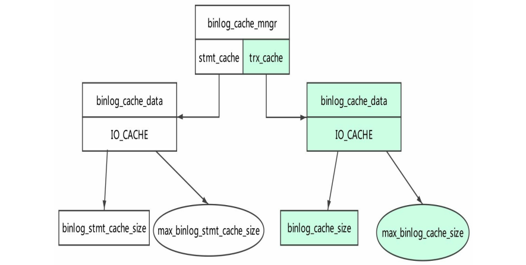

#### binlog cache简介

当我们执行DML语句的时候会向binlog cache不断地写入Event，作为Event的“中转站”， 我们有必要详细地学习其原理。

##### binlog cache综述

整个事务的Event在commit时才会真正写入binary log，在此之前，这些Event都被存放在 另一个地方，我们可以将其统称为binlog cache。图3-1是binlog cache的结构图。

在这个结构图中我们主要研究trx_cache部分。binlog cache是由IO_CACHE实现的，其中 包含以下两部分。

- binlog cache缓冲区：由参数binlog_cache_size控制。
- binlog cache临时文件：由参数max_binlog_cache_size控制。

下面将使用binlog cache缓冲区和binlog cache临时文件来分别代表这两部分。

##### 使用binlog cache的流程

1. 开启读写事务。 
2. 执行DML语句，在DML语句第一次执行时会分配内存空间给binlog cache缓冲区。 
3. 执行DML语句期间生成的Event不断写入binlog cache缓冲区。 
4. 如果binlog cache缓冲区已经写满，则将binlog cache缓冲区的数据写入binlog cache临 时文件，同时清空binlog cache缓冲区，这个临时文件名以ML开头。 
5. 事务提交，binlog cache缓冲区和binlog cache临时文件数据全部写入binary log进行 固化，释放binlog cache缓冲区和binlog cache临时文件。注意，保留此时binlog cache缓冲区的 内存空间，以供下次事务使用，binlog cache临时文件的大小被截断为0，保留文件描述符。 也就是保留IO_CACHE结构，并且保留IO_CACHE中分配的内存空间和临时文件的文件描述 符。 
6. 断开连接，这个过程会释放IO_CACHE，同时释放其持有的binlog cache缓冲区及 binlog cache临时文件。

下一节我们将介绍Event写入的流程

##### 参数binlog_cache_size的作用及其初始化

参数binlog_cache_size是会话级别的参数，官方文档中声明，如果开启了binary log功 能，则用于表示在事务执行期间保存Event的缓存大小。如果经常使用大事务，则应该加大 这个参数，避免使用过多的物理磁盘。其默认大小为32768字节。

从binlog_cache_use和binlog_cache_disk_use中可以看出是否使用了binlog cache缓冲区和 binlog cache临时文件，计数单位是次。我们可以在THD：：binlog_setup_trx_data函数中找到 参数binlog_cache_size的生效点，代码片段如下。