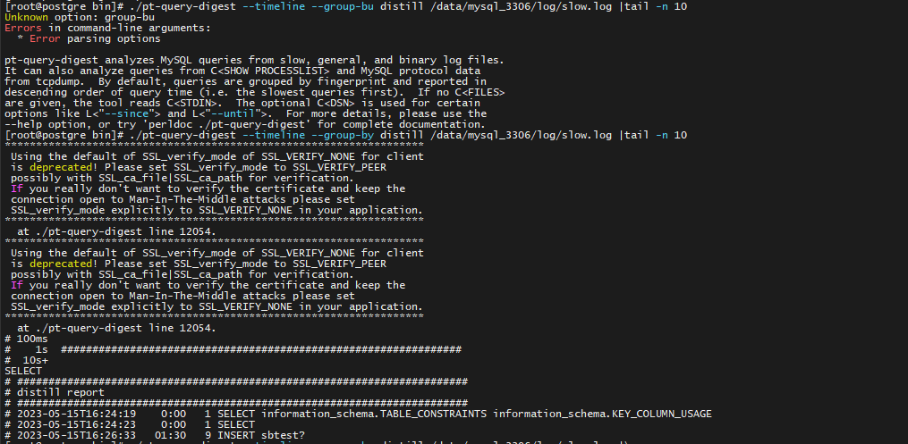
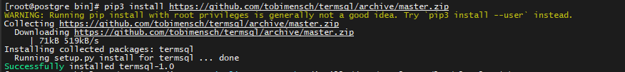
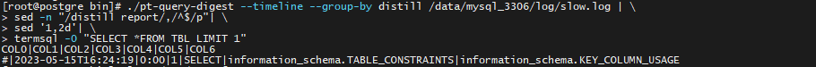
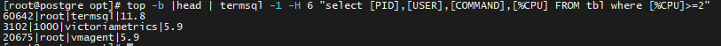

SLOW LOG分析：

传统工具percona-toolkit pt-query-digest（percona-toolkit-3.3.1）

基本部署要素：

```sh
yum -y install perl-DBD-MySQL ncftp perl-DBI
yum install -y perl-DBD-MySQL perl-Config-Tiny perl-Log-Dispatch perl-Parallel-ForkManager
```

依赖解决完、开箱即用；

简单demo如下：

```sh
./pt-query-digest --timeline --group-bu distill /data/mysql_3306/log/slow.log |tail -n 10
```



利用sed过滤报告 如下：

> ```sh
> ./pt-query-digest --timeline --group-by distill /data/mysql_3306/log/slow.log | \
> sed -n "/distill report/,/^$/p"| \
> sed '1,2d'
> ```


安装辅助工具与termsql

```sh
pip3 install https://github.com/tobimensch/termsql/archive/master.zip
```



再次查看报告样式：

```sh
./pt-query-digest --timeline --group-by distill /data/mysql_3306/log/slow.log | \
sed -n "/distill report/,/^$/p"| \
sed '1,2d'| \
termsql -0 "SELECT *FROM TBL LIMIT 1"
```



```sh
./pt-query-digest --timeline --group-by distill /data/mysql_3306/log/slow.log | sed -n "/distill report/,/^$/p"| sed '1,2d'| termsql -0 "
SELECT strftime('%Y-%m-%d %H:00',COL1 || ' ' || COL2) AS Time,SUM(COL4) AS Count FROM tbl GROUP BY Time"
```

termsql技巧：

```sh
top -b |head | termsql -1 -H 6 "select [PID],[USER],[COMMAND],[%CPU] FROM tbl where [%CPU]>=2"
```




宏观统计slow log

```sql
-- 获取时间段的慢查询总的
[root@localhost log]# less mysql-slow.log |grep "# Tim"|awk -F "." '{print $1}'|termsql -0 "select COL2 as time,COUNT(COL2) as sql_count from tbl group by COL2"
time|sql_count
2023-08-11T10:08:39|1
2023-08-11T11:21:21|2
2023-08-11T11:21:47|2
2023-08-11T11:24:02|2
2023-08-11T11:24:05|2
2023-08-11T13:10:35|2
2023-08-11T13:14:38|2
2023-08-11T13:24:51|3
2023-08-11T13:25:12|2
2023-08-11T13:25:21|2
2023-08-11T13:48:44|1
2023-08-11T13:48:48|1
2023-08-11T13:49:04|2
2023-08-11T13:54:43|1
2023-08-11T14:00:30|2
2023-08-11T14:07:55|1
2023-08-11T14:28:51|2
2023-08-11T14:49:41|2
..

-- 获取slow log文件中所有慢查询类型的总和
[root@localhost log]# less mysql-slow.log |grep "# Time" -A 6 |egrep  -i "insert|delete|update|select|commit|show"   |awk '{print $1}'|sed -e 's/;/ /g' |termsql -0 "select COL0 as sql_stat,count(COL0) as Count from tbl group by sql_stat"
sql_stat|Count
SELECT|132199
SHOW|3
SUM_TIMER_FETCH,|6320
UPDATE|1
select|42

-- 获取某个节点的慢查询
[root@localhost log]# less mysql-slow.log |grep "2023-08-29T10:36:47" -A 6 |egrep  -i "2023-08-29T10:36:47|insert|delete|update|select|commit|show"  |
> sed -e 's/# Time:/ /g'|awk '{print $1,$2}'|awk '{print $1}'|awk -F '.' '{print $1}'|termsql -0 "select COL0 ,count(COL0) count from tbl group by COL0"
COL0|count
2023-08-29T10:36:47|18
select|18

-- 获取锁节点的时间明细
[root@localhost log]# less mysql-slow.log |grep "2023-08-29T10:36:47" -A 3 |grep "Lock_time"|awk '{print $4,$5,$8,$9}'
Lock_time: 0.000005 Rows_examined: 810
Lock_time: 0.000002 Rows_examined: 810
Lock_time: 0.000001 Rows_examined: 810
Lock_time: 0.000004 Rows_examined: 266
Lock_time: 0.000002 Rows_examined: 266
Lock_time: 0.000002 Rows_examined: 266
Lock_time: 0.000004 Rows_examined: 104
Lock_time: 0.000006 Rows_examined: 104
Lock_time: 0.000011 Rows_examined: 272
Lock_time: 0.000008 Rows_examined: 429
Lock_time: 0.000001 Rows_examined: 429
Lock_time: 0.000001 Rows_examined: 429
Lock_time: 0.000001 Rows_examined: 429
Lock_time: 0.000001 Rows_examined: 429
Lock_time: 0.000001 Rows_examined: 429
Lock_time: 0.000005 Rows_examined: 112
Lock_time: 0.000007 Rows_examined: 265
Lock_time: 0.000004 Rows_examined: 258

```


